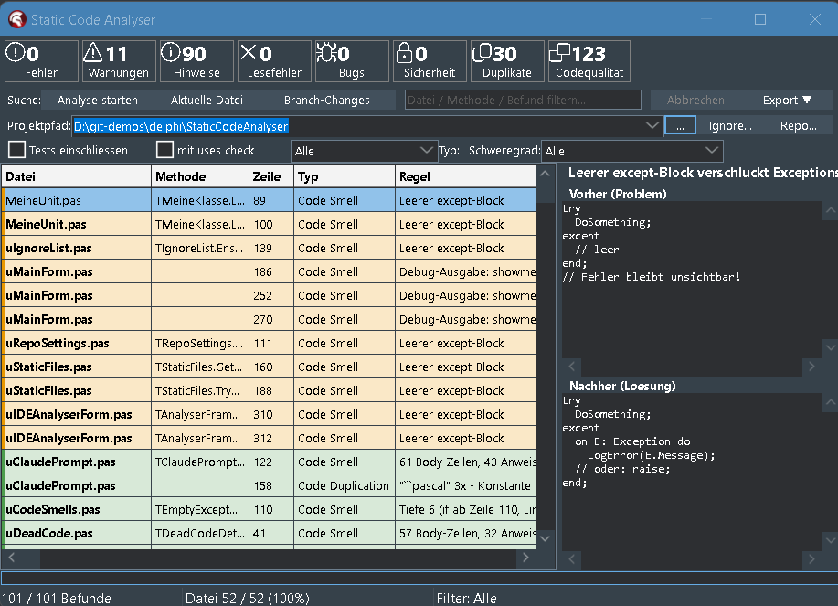

# Static Code Analysis Tool for Delphi

[](https://paypal.me/nrodear)

[](LICENSE)
[](https://paypal.me/nrodear)

> If this plugin saves you time in your Delphi work, a coffee is appreciated. 🙏

---

**Delphi static code analysis tool** and **linter** for **RAD Studio 12 (Athens)** —
ships as an **IDE plugin** with a dockable tool window plus a **standalone Windows app**.
AST-based analysis with **41 detectors total**: 21 Pascal checks for memory leaks,
SQL injection, code smells, security vulnerabilities and code duplication, **plus a
dedicated DFM scanner with 20 checks** built on its own DFM lexer + parser + component
graph paired with the Pascal AST — dead event handlers, hard-coded DB credentials in
form files, circular master-detail wiring, required dataset fields without UI binding,
SQL built from `TEdit.Text`, cross-form coupling, and more. Sonar-style classification
with a Quality Score. Repo-wide form index for cross-unit analysis. VCS-diff mode
treats `.dfm` changes as triggers for the companion `.pas`. HTML report with grouped
`.pas`+`.dfm` filter. IDE plugin opens DFM findings as text directly in the Code
Editor. One click on a finding copies an AI-ready Markdown fix prompt to the
clipboard. Open source, MIT-licensed.

🇩🇪 [Deutsche Version](README_de.md)



---

## What this plugin does

In one sentence: **Sonar-style analysis for Delphi projects, with no
Sonar setup required, running inside the IDE, with a Claude AI hand-off.**

| Capability | Details |
|------------|---------|
| 🐛 **Bug detection** | 21 Pascal detectors run against every `.pas` file (MemoryLeak, NilDeref, DivByZero, FormatMismatch, …) plus 20 DFM detectors against every `.dfm` (dead event handlers, hard-coded DB credentials, circular master-detail, …) — **41 total** |
| 🔐 **Security checks** | SQLInjection (score-based), HardcodedSecret, HardcodedPath |
| 🧹 **Code smells** | LongMethod, MagicNumber, EmptyExcept, MissingFinally, DeadCode, DuplicateString/Block |
| ⚡ **Incremental analysis** | "Branch-Changes" button: only the files modified in the Git/SVN branch — 200 ms instead of 60 s |
| 🤖 **Claude AI prompt** | Click a finding → a complete Markdown block with code context + before/after is copied to the clipboard |
| 📊 **Sonar-style dashboard** | Stat tiles above the grid: Errors / Warnings / Hints / Bugs / Vulnerabilities / Code Quality score |
| 🎯 **Filter & sort** | Severity dropdown, type dropdown, live search box, clickable column headers |
| 📤 **Export** | CSV, JSON, self-contained HTML report, Jira wiki markup, plain-text clipboard with before/after |
| 🔇 **Suppression** | `// noinspection MemoryLeak` per line, plus `ignore.txt` for whole files |
| 🌓 **Theme aware** | Follows the active IDE theme automatically (Light / Dark / Mountain Mist / Carbon) |
| 💡 **Before/after help** | Every detector has a paired "wrong way / right way" code example in the help panel |

---

## Main features

### 1. Static code analysis (41 detectors total — 21 Pascal + 20 DFM, Sonar taxonomy)

**Pascal AST checks (21)**: **bugs** (MemoryLeak, NilDeref, DivByZero,
FormatMismatch), **vulnerabilities** (SQLInjection, HardcodedSecret),
**security hotspots** (HardcodedPath), **code smells** (LongMethod,
MagicNumber, DeadCode, EmptyExcept, MissingFinally, …), and **code
duplication** (DuplicateString, DuplicateBlock).

**DFM checks (20)** on the dedicated form-file lexer + parser +
component graph, paired with the Pascal AST via the FormBinder: dead
event handlers, hard-coded DB credentials in form files, circular
master-detail wiring, required dataset fields without UI binding, SQL
built from `TEdit.Text`, cross-form coupling, duplicate-control
hot-keys, untranslated Caption strings, and more. Repo-wide form
index for cross-unit analysis.

Every finding ships with a before/after fix in the help panel.

### 2. Incremental VCS-aware analysis (Git + SVN)

Skip the full project scan. **One click on `Branch-Changes`** is enough:
the analyser asks `git diff` (or `svn status`) for the `.pas` files
touched in your branch and runs the detectors only on those.
**~200 ms instead of 60 s** for a typical feature branch — cheap enough
to use as a pre-commit gate. Configuration lives in `analyser.ini`. Full
details in [BRANCH_CHANGES.md](BRANCH_CHANGES.md).

### 3. AI hand-off (Claude prompt with one click)

Click a finding row in the grid and the clipboard is filled with a
**ready-made Markdown prompt**: finding metadata, code context (±5
lines, with a marker on the offending line), and the before/after fix.
Paste it into Claude with **Ctrl+V** — the AI now has everything it
needs to suggest a concrete patch.

---

## Quick start

1. **Build and install** the plugin: open `StaticCodeAnalyserIDE\StaticCodeAnalyserIDE.dpk`,
   run **Build**, then **Install** (right-click the package in Project
   Manager → **Install**, or use **Component → Install Packages** from
   the menu and pick the package). Without the install step the plugin
   compiles but never appears in the IDE menu.
2. In Delphi: **View → Static Code Analysis Tool for Delphi** — the
   dockable window shows up.
3. Pick a project path → click **Start analysis**.

For incremental scans of branch-changed files only, see
[BRANCH_CHANGES.md](BRANCH_CHANGES.md).

---

## What is detected (41 detectors — 21 Pascal + 20 DFM)

Findings fall into one of **five Sonar categories**:

| Category | Detector | Severity |
|----------|----------|----------|
| **Bug** | `MemoryLeak` (LeakDetector + FieldLeak) | Error / Warning |
| | `NilDeref` (nil dereference) | Error |
| | `DivByZero` (division by zero) | Error / Warning |
| | `FormatMismatch` (format vs argument count) | Error |
| **Vulnerability** | `SQLInjection` (score-based) | Error |
| | `HardcodedSecret` (API keys, passwords) | Error |
| **Security Hotspot** | `HardcodedPath` (`C:\…`, `/etc/…`) | Warning |
| **Code Smell** | `EmptyExcept` (silent swallow) | Warning |
| | `MissingFinally` (Free outside finally) | Warning |
| | `DeadCode` (unreachable after exit/raise) | Warning |
| | `UnusedUses` (optional, default off) | Hint |
| | `LongMethod`, `LongParamList` | Hint |
| | `MagicNumber` (in if conditions) | Hint |
| | `DebugOutput` (`OutputDebugString` etc.) | Warning |
| | `DeepNesting` | Warning |
| | `TodoComment` (TODO/FIXME/HACK) | Hint |
| | `EmptyMethod` | Hint |
| **Code Duplication** | `DuplicateString` (same literal, ≥3 occurrences) | Hint |
| | `DuplicateBlock` (≥ `DuplicateBlockMinLines`, default 8 identical lines) | Hint |
| **Read error** | `FileReadError` (parser hang or oversized file) | Error |

Every detector comes with a **before/after code example** in the help
panel. Clicking a finding copies a **Markdown block ready for Claude AI**
to the clipboard.

For the **20 DFM-specific detectors** (DFM-DeadEventHandler,
DFM-HardcodedDBCredentials, DFM-CircularMasterDetail,
DFM-MissingRequiredFieldBinding, DFM-SQLFromTEditText, …) and their
fix hints: see [DETECTORS.md](DETECTORS.md).

Full status of all 50 Sonar rules: see [DETECTORS.md](DETECTORS.md).

---

## Usage

### Buttons (left to right)

| Button | Function |
|--------|----------|
| **Folder picker** (`...`) | Choose the project folder |
| **Settings...** | Open `analyser.ini` — VCS settings, custom LeakyClasses (see [BRANCH_CHANGES.md](BRANCH_CHANGES.md)) |
| **Ignore...** | Open `ignore.txt` — file/folder exclusion list |
| **Start analysis** | Recursive folder scan |
| **Current file** | Just the `.pas` file currently open in the editor |
| **Branch-Changes** | Only files changed in Git/SVN (see [BRANCH_CHANGES.md](BRANCH_CHANGES.md)) |
| **Cancel** | Aborts a running analysis |

### Per-detector configuration

There are no toggle checkboxes in the toolbar. All optional detector
behaviour is configured via `analyser.ini` (see _Configuration files_
below) — open it through the **Settings…** button, edit, save, click
**Start analysis** again. Settings are reloaded on every run, no IDE
restart required.

### Stat cards

Two card rows above the grid show how findings are distributed:

- **By severity**: Errors / Warnings / Hints / Security risks / Read errors
- **By type**: Code Smell / Bug / Vulnerability / Security Hotspot / Code Duplication / Read errors

Both rows are guaranteed to add up to the same total.

### Filter

- **Severity / type dropdowns**: narrow the grid down to a single category.
- **Search box** (`Filter file / method / finding`): live filter across
  every column.

### Grid interaction

| Action | Effect |
|--------|--------|
| **Click a row** | Finding is copied to the clipboard as a Markdown prompt for Claude AI **and** — if the file is open in the IDE — a 3 px red stripe is painted on the left edge of the corresponding line in the editor |
| **Double-click** | Open the file in the IDE, jump to the finding line, paint the line marker |
| **Hover (file column)** | Tooltip with the full file path (100 ms delay) |
| **Click a column header** | Sort by that column |
| **3 px stripe on the left edge** of the grid row | Severity accent (red / orange / green / blue) |

The right-side **help panel** with before/after code blocks is shown only
when the IDE plugin window is **floating** — when docked into a side
bar / tab the panel auto-hides and the grid takes the full width
(re-appears within ~250 ms after un-docking).

### Export

| Button | Format | Content |
|--------|--------|---------|
| **JSON** | `.json` | All findings as an array |
| **CSV** | `.csv` | Excel-friendly (semicolon-separated) |
| **HTML report** | `.html` | Self-contained report with sort, filter, code snippets, before/after. Click a severity badge to filter — also hides files in the dropdown that have no findings of that severity (combinable with the file dropdown filter, AND-linked) |
| **Jira** | Clipboard | Wiki markup ready to paste into a Jira ticket (filtered to one file) |
| **Clipboard** | Clipboard | Plain text with before/after (filtered to one file) |

---

## Language / localisation

The UI source language is **English**. UI strings are wrapped with the
`_('…')` macro from `uLocalization.pas`, which routes through dxgettext
(GNU gettext for Delphi) when activated.

### Switching the language

| State | Effect |
|-------|--------|
| **Default (no dxgettext)** | UI displays the source strings as-is — English |
| **dxgettext activated, no `SetLanguage` call** | UI follows system locale via `gnugettext.UseLanguageFromSysLocale` |
| **`uLocalization.SetLanguage('de')`** | UI switches to German via `i18n/de.po` |
| **`uLocalization.SetLanguage('fr')`** | UI switches to French via `i18n/fr.po` |
| **`uLocalization.SetLanguage('en')`** | UI forced to English |

To set the language at startup, call `SetLanguage` early in
`TAnalyserDockableForm.FrameCreated` (IDE plugin) or in the standalone's
`TForm2.FormCreate`:

```pascal
uses uLocalization;

SetLanguage('de');   // 'de' / 'en' / 'fr' / '' (= system default)
```

### Where translations live

| Path | Purpose |
|------|---------|
| `i18n/template.pot` | Source-language template (English) |
| `i18n/de.po` | German translation |
| `i18n/fr.po` | French translation |
| `i18n/en.po` | English baseline (identity) |
| `locale/<lang>/LC_MESSAGES/default.mo` | Compiled binary, loaded at runtime |

The `.po` files are plain text and Git-friendly; edit them with
[poEdit](https://poedit.net/) or a regular editor.

### Activating dxgettext (one-time setup)

Without dxgettext installed, the wrapper is a passthrough — every `_()`
call returns the source string unchanged, so the UI stays English no
matter what `SetLanguage` is called with.

To get real translations:

1. Clone <https://github.com/sjrd/dxgettext>
2. Add the `dxgettext/Source/` folder to `DCC_UnitSearchPath` of the
   IDE plugin and the standalone EXE
3. Add `{$DEFINE USE_GETTEXT}` in the `.dpk` (or in **Project Options →
   Conditional Defines**)
4. Compile every `.po` to `.mo`:
   ```
   msgfmt i18n/de.po -o locale/de/LC_MESSAGES/default.mo
   msgfmt i18n/fr.po -o locale/fr/LC_MESSAGES/default.mo
   ```
5. Place the `locale/` folder next to the BPL/EXE

Full step-by-step instructions: [I18N.md](I18N.md).

---

## Theme integration

The plugin tracks the active Delphi IDE theme through several
mechanisms:

- **`StyleServices.GetSystemColor`** in custom drawing (OnDrawCell, TTilePanel.Paint)
- **`clBtnFace` / `clWindow` / `clBtnText`** as property values (auto-themed via VCL Styles)
- **`IOTAIDEThemingServices.ApplyTheme`** when the frame is hosted
- **`INTAIDEThemingServicesNotifier`** for live theme changes
- **`CM_STYLECHANGED`** plus a **`SetParent` override** as additional triggers

Severity background colors are blended at paint time from the themed
`clWindow` base mixed with a saturated accent color, so the same code
works in any theme without separate light/dark tables.

**Known limitation**: in floating mode the plugin window does not pick
up runtime IDE theme changes reliably — `INTACustomDockableForm` exposes
no official hook for re-applying the theme on the wrapper form.
Workaround: dock the plugin, or close and re-open the window after
switching themes.

---

## Using the analyser with Git and SVN

The analyser **auto-detects** the VCS system based on the project
directory (looks for `.git/` or `.svn/` markers). Custom rules and
all detector configuration are **VCS-agnostic** — the same workflow
works with both systems.

### Auto-detection

| Marker in project path | Detected as | Backend CLI |
|---|---|---|
| `.git/` (or any parent contains `.git/`) | Git | `git diff` + `git status` |
| `.svn/` | SVN | `svn status` + `svn diff` |
| neither | None | `--branch` disabled, `--full` works |

The VCS executable is located via `PATH`, then typical install paths
(TortoiseGit, TortoiseSVN, Git for Windows, ...). Override via
`analyser.ini` (see below).

### Using with Git

**Plugin/GUI**: point the project path at the Git working tree, then
click **Branch-Changes**. The analyser determines:
- Modified `.pas` files between `BaseBranch` and `HEAD` (committed)
- Plus uncommitted working-tree modifications (when `IncludeWorkingTree=1`)

**CLI**:
```powershell
analyser.d12.exe --path D:\my-git-repo --branch --report-sarif sca.sarif
```

**`analyser.ini` settings for Git**:
```ini
[Repo]
BaseBranch=develop          ; empty = auto: origin/HEAD -> main -> master
IncludeWorkingTree=1        ; 1 = include uncommitted changes, 0 = committed only

[Paths]
GitExe=C:\custom\git\bin\git.exe   ; empty = auto-detection
```

### Using with SVN

**Plugin/GUI**: identical to Git — pick the working-copy path, click
**Branch-Changes**. Since SVN has no real "branch" concept in a
working copy, branch mode here returns:
- All uncommitted changes (`svn status` output: M/A/R/D/?)
- Optionally extended with committed differences since BASE revision

Ideal as a **pre-commit hook**: it checks exactly what would go into
the next `svn commit`.

**CLI**:
```powershell
analyser.d12.exe --path D:\my-svn-wc --branch --report-sarif sca.sarif
```

**`analyser.ini` settings for SVN**:
```ini
[Repo]
BaseBranch=trunk            ; SVN: typically trunk (informational, no real diff)
IncludeWorkingTree=1        ; include uncommitted changes

[Paths]
SvnExe=C:\custom\svn\bin\svn.exe   ; empty = auto: PATH + TortoiseSVN
```

**Auto-detected SVN paths**:
1. `svn.exe` in PATH
2. `C:\Program Files\TortoiseSVN\bin\svn.exe`
3. `C:\Program Files (x86)\TortoiseSVN\bin\svn.exe`
4. `C:\Program Files\Subversion\bin\svn.exe`

### Custom rules with both VCS

The [custom-rule engine](examples/README.md) (YAML profiles) is
VCS-independent — it just reads files. Recommended workflow for
**both** VCS systems:

1. Place `analyser-rules.yml` (or one of the profiles from
   `examples/`) in the **project root** — Git/SVN version it along
   with the source
2. Reference it in `analyser.ini`:
   ```ini
   [Detectors]
   CustomRulesFile=analyser-rules.yml   ; relative to project root
   ```
3. Plugin/GUI loads it automatically on the next analysis run

This way each project carries **its own ruleset in the repo** —
team-shared, versioned, reviewable in PR/MR diffs.

### CI/CD integration

**GitHub Actions** (Git): see template [`.github/workflows/sca.yml`](.github/workflows/sca.yml).
SARIF upload appears as inline annotations in PRs.

**GitLab CI / Jenkins / TeamCity / Azure DevOps**: same pattern —
make the tool available in the pipeline image, run `analyser.exe
--path . --branch --report-sarif sca.sarif`, attach the artifact or
process further (SARIF plugins available for most CI systems).

**SVN pre-commit hook** (server-side, Linux):
```bash
#!/bin/sh
# /path/to/svn-repo/hooks/pre-commit
REPOS="$1"
TXN="$2"

# Adjust tool path and working-copy mirror
ANALYSER=/opt/sca/analyser.d12.exe
WC=/tmp/sca-precommit-$TXN

svn export "$REPOS" "$WC" -r "$TXN" --quiet
"$ANALYSER" --path "$WC" --full --quiet
EXIT=$?
rm -rf "$WC"
exit $EXIT
```

Exit code mapping:
- 0 = clean → commit allowed
- 1 = hints only → commit allowed
- 2 = warnings → commit allowed (or block via hook logic)
- 3 = errors → **commit blocked**

---

## Configuration files

All under `%APPDATA%\StaticCodeAnalyser\`:

| File | Content |
|------|---------|
| `analyser.ini` | All settings — VCS (BaseBranch, git/svn paths), detector toggles (`UsesCheck`, `IncludeTests`, `AutoDiscoverClasses`), custom `LeakyClasses` / `ExcludeLeakyClasses`, detector thresholds, UI language. The file is created on first start with self-documenting comments next to every option |
| `ignore.txt` | File and directory patterns to skip during analysis |
| `recent.ini` | Recently used project paths |
| `LeakyClassesDiscover.log` | Output of `AutoDiscoverClasses=1` — discovered classes split into _instantiable_ (have ctor/dtor or `Create()` call) and _static-only candidates_. Manually copy the relevant ones into `LeakyClasses=` in `analyser.ini` |
| `StaticCodeAnalyser_scan.log` | Diagnostic log: which file took how long |

### Detector thresholds (all optional, in `[Detectors]`)

| Key | Default | Effect |
|-----|---------|--------|
| `LongMethodMaxBodyLines` | 50 | `LongMethod` triggers when both body-line count AND statement count are above their thresholds |
| `LongMethodMaxStatements` | 30 | (secondary threshold for `LongMethod`) |
| `LongParamListMaxParams` | 5 | `> N` parameters → refactoring hint |
| `DeepNestingMaxDepth` | 4 | `> N` nested control structures |
| `CyclomaticMax` | 10 | McCabe complexity `> N` per method (counts `if`, `case` arm, `for`/`while`/`repeat`, `on` handler, `and`/`or`/`xor`) |
| `DuplicateBlockMinLines` | 8 | minimum normalised line count for duplicate-block detection |
| `MaxFileMB` | 5 | files larger than that are skipped (OOM guard for generated code) |
| `MagicNumberTrivials` | `0,1,2,-1,10,100` | numbers exempt from `MagicNumber` detection |
| `UsesCheck` | 0 | `UnusedUses` detector (off by default — can produce false positives) |
| `IncludeTests` | 0 | include `uTest*.pas`, `*_Tests.pas`, `TestProject*.dpr`, `/tests/` directories |
| `AutoDiscoverClasses` | 0 | scan project AST for custom classes that need `Free` and add them to `LeakyClasses` |
| `LeakyClasses` | _(empty)_ | comma-separated list of additional classes to track |
| `ExcludeLeakyClasses` | _(empty)_ | comma-separated list of classes to NOT track even if they're in the defaults |

### Live-Watch (IDE plugin only) — ⚠️ RISKY

Clicking **Current file** in the IDE plugin activates a single-file live watch
on exactly that file: every save (300 ms debounced) and every edit (1000 ms
debounced) re-runs the analysis for THIS file in a background thread. Switching
tabs to another file changes nothing; clicking **Current file** again moves the
watch to the new file. Bulk paths (**Run analysis**, **Branch changes**)
explicitly deactivate the watch. There is no INI flag for this.

> ⚠️ **Infinite-loop risk.** There is currently **no re-entrancy guard** for
> overlapping worker spawns. If the worker takes longer than the edit debounce
> (1000 ms) and the user keeps typing, the worker backlog will grow rather
> than shrink. Additionally (Delphi-version dependent), an editor repaint
> following a findings update can be re-interpreted as `Modified` — edit/save
> paths can then re-trigger each other. The only safety today is the
> generation counter (drops _late_ results, but does not prevent overlapping
> spawns). Add a re-entrancy guard + hard cap before broader use
> (`TODO.md` -> _Single-File-Live-Watch_).

---

## Suppression

Silence individual findings inline:

```pascal
// noinspection MemoryLeak
list := TStringList.Create;

// noinspection NilDeref, DivByZero
DoSomethingRisky;

// noinspection All
// suppress every check on the next line
```

Recognised category names (one per registered detector — single source of
truth is `KIND_META` in `uSCAConsts.pas`):

`MemoryLeak`, `EmptyExcept`, `SQLInjection`, `HardcodedSecret`,
`FormatMismatch`, `FileReadError`, `UnusedUses`, `NilDeref`,
`MissingFinally`, `DivByZero`, `DeadCode`, `LongMethod`, `LongParamList`,
`MagicNumber`, `DuplicateString`, `HardcodedPath`, `DebugOutput`,
`DeepNesting`, `TodoComment`, `EmptyMethod`, `DuplicateBlock`, `All`.

---

## Ownership transfer (no MemoryLeak warning)

These patterns are recognised as ownership hand-off and don't trigger a
MemoryLeak finding:

| Pattern | Meaning |
|---------|---------|
| `Result := varName` | Function returns ownership to its caller |
| `varName.Parent := winControl` | VCL: TWinControl frees its `Controls[]` children |
| `varName := X.Add(...)` | Borrowed return — item lives in container's `OwnsObjects` list |
| `varName := X.AddChild(...)` | AST / DOM tree: child owned by parent |
| `varName := X.AddNode(...)` | TTreeView etc. |
| `varName := X.AppendChild(...)` | XML-DOM / IXMLNode |
| `FField := varName` | Var-to-field transfer — ownership leaves method scope |
| `FField := varName as ISomething` | Interface-refcount keeps the object alive |
| `inherited Create(varName, …)` | Parent constructor takes ownership |
| `TAnyClass.Create(varName, …)` | Another constructor takes ownership |
| `Container.Add(varName)` | TObjectList (etc.) takes ownership |
| `Container.Add(key, varName)` | TObjectDictionary takes ownership |
| `Container.AddObject(text, varName)` | TStringList with objects |
| `Container.Insert(i, varName)` | TList.Insert |
| `Container.Push(varName)` | TStack.Push |
| `Container.Enqueue(varName)` | TQueue.Enqueue |

For **class fields**, the FieldLeak detector additionally recognises
the standard TComponent-owner pattern as no-leak:

| Pattern | Meaning |
|---------|---------|
| `FField := X.Create(Self)` | TComponent owner: `inherited Destroy` calls `DestroyComponents` |
| `FField := X.Create(AOwner)` | Owner forwarded from constructor parameter |
| `FField := X.Create(Owner)` | Owner taken from existing field/property |

---

## Architecture

```
StaticCodeAnalyserIDE/                 IDE expert package (.dpk)
  uIDEExpert.pas                       Wizard registration (IOTAMenuWizard)
  uIDEAnalyserForm.pas                 Dockable window (TFrame) - main shell:
                                       filters, stats grid, sort, export,
                                       Claude prompt copy, lifecycle sentinel
  uIDELineHighlighter.pas              3 px red stripe in the IDE editor
                                       gutter on the offending line
  uIDEMessages.pas                     Hand-off into the IDE Messages tab
  uIDEWatchMode.pas                    Single-file live watch (Current file)
                                       save 300 ms / edit 1000 ms debounced
                                       ⚠️ no re-entrancy guard - see README
  uIDEStatsTiles.pas                   Sonar-style tile row builder
  uIDEHelpPanel.pas                    Right-side help panel with before/after,
                                       auto-hide when docked
  uIDEExportMenu.pas                   Export dropdown (JSON/CSV/HTML/Jira)
  uIDEEditorIntegration.pas            ToolsAPI wrappers: current .pas file,
                                       project dir, OpenFileAtLine
  uIDEStatusBar.pas                    Three-panel status bar
                                       (findings / progress / mode)
  uIDEThemeIntegration.pas             IDE-theme notifier + ApplyTheme refresh
  uIDEAnalyseProgress.pas              Busy-state controller
                                       (Begin/EndRun, Cancel-flag)

StaticCodeAnalyserForm/sources/        Analysis engine (shared by standalone + IDE plugin)
  Common/
    uSCAConsts.pas                     TFindingKind + KIND_META single source
                                       of truth (Sonar category mapping)
    uMethodd12.pas                     TLeakFinding record + helpers
    uRecentPaths.pas                   recent.ini handling
    uRegExMatches.pas                  shared regex helpers
    uDetectorUtils.pas                 IsIdentChar, IsWholeWord helpers
    uCollectValues.pas                 AST literal-value collection

  UI/
    uAnalyserPalette.pas               Central colour constants
    uAnalyserTypes.pas                 TFindingSeverity enum + conversions
    uAnalyserTheme.pas                 SeverityBg, SeverityAccent, BlendColor
    uFindingGridRenderer.pas           StringGrid OnDrawCell logic
    uFindingFilter.pas                 Severity/type/search filter pipeline
    uLocalization.pas                  dxgettext wrapper (_('…') macro)

  Parsing/
    uLexer.pas                         Tokeniser, watchdog (200k tokens)
    uParser2.pas                       Recursive-descent parser with
                                       forward-progress guarantee
    uAstNode.pas                       AST with FindAll / FindFirst lookup

  Infrastructure/
    uStaticAnalyzer2.pas               Orchestrates the 21 Pascal detectors per file
    uStaticFiles.pas                   Recursive file scan, tick callback,
                                       cancel support, symlink protection
    uIgnoreList.pas                    ignore.txt + test filter
    uVcsChanges.pas                    Git/SVN diff via CreateProcess + pipe
    uRepoSettings.pas                  analyser.ini (BaseBranch, exe paths)
    uSuppression.pas                   // noinspection markers
    uExport.pas                        JSON / CSV / Jira / clipboard
    uExportHtml.pas                    Self-contained HTML report

  Output/
    uClaudePrompt.pas                  AI Markdown prompt generator
    uFixHint.pas                       Before/after example per finding type

  Detectors/
    uLeakDetector2.pas                 MemoryLeak (local-var, AST-based)
    uFieldLeak.pas                     Class-field leak (Create / Destroy)
    uCodeSmells2.pas                   EmptyExcept
    uSQLInjection.pas                  + uSQLInjectionScore.pas (scoring)
    uHardcodedSecret.pas, uHardcodedPath.pas
    uFormatMismatch.pas, uUnusedUses.pas
    uNilDeref.pas, uMissingFinally.pas
    uDivByZero.pas, uDeadCode.pas
    uLongMethod.pas, uLongParamList.pas
    uMagicNumbers.pas, uDuplicateString.pas
    uDuplicateBlock.pas
    uDebugOutput.pas, uDeepNesting.pas
    uTodoComment.pas, uEmptyMethod.pas
    uCustomClassDiscovery.pas          AutoDiscoverClasses helper
                                       (not a detector — feeds LeakyClasses)
```

### Data flow

```
File → Lexer → Parser2 → AST (TAstNode)
                            │
                            ├── 21 detectors run in parallel (try/except per detector)
                            │       each emits TLeakFinding
                            │
                            └── TSuppression strips noinspection markers
                                        │
                                        └── TObjectList<TLeakFinding>
                                                │
                                                └── PopulateFindings →
                                                    Stat cards + grid + export
```

---

## Performance

For a typical 1 000-unit repository:

| Phase | Per file | 1 000 files |
|-------|----------|-------------|
| Folder scan | — | 1–3 s |
| Lexer | ~5–15 ms | ~10 s |
| Parser2 | ~10–50 ms | ~30 s |
| 21 Pascal detectors | ~5–30 ms | ~20 s |
| DFM parser + 20 DFM detectors (per `.dfm`) | ~5–20 ms | ~5–10 s |
| Suppression sweep | — | <1 s |
| **Total** | **~30–100 ms** | **~60–90 s** |

For incremental re-scans, **use Branch-Changes instead of a full scan**
— typically 200 ms to 3 s. See [BRANCH_CHANGES.md](BRANCH_CHANGES.md).

### Robustness

- **Watchdog**: 200k-token limit per file — pathological inputs are
  aborted in under a second instead of hanging.
- **GuardAdvance**: forward-progress guarantee in every outer parser loop.
- **Real-world Delphi syntax coverage**: the parser handles `interface`
  type declarations, generic types/methods (`TFoo<T>`, `function Get<T>: T;`),
  `packed record` / `packed class`, local `label` sections, `record helper for X`
  / `class helper for X`, and IFDEF-conditional method headers without
  losing method bodies — important for real-world codebases (mORMot2, etc.).
- **`MaxFileMB` (default 5 MB)**: oversized files are reported immediately
  as `FileError`. Configurable in `analyser.ini`.
- **MAX_DEPTH = 32**: protection against symlink loops.
- **Cancel any time**: `EAbort` propagates cleanly through every layer.
- **Per-detector try/except**: a crashing detector never blocks any of
  the other forty.

---

## Test projects

```
StaticCodeAnalyserForm/tests/
  TestProject.dpr                      DUnitX console runner
  uTestAnalyserChecks.pas              ~290 tests in 26 fixtures
                                       (one fixture per detector)
  uTestTAstNode.pas                    AST helper tests
  uTestPerformance.pas                 Throughput benchmarks
                                       (tokens/ms, lines/ms)
```

Tests run on DUnitX. In console mode the test project emits an NUnit
XML report — ready to wire into CI.

---

## Requirements

- Delphi 12 (Athens)
- DUnitX (only for the test suite, not for the plugin itself)
- Optional: Git for Windows or TortoiseSVN **with** CLI tools for the
  Branch-Changes feature

### Build targets

| Target | Win32 | Win64 |
|--------|-------|-------|
| **IDE plugin** (`StaticCodeAnalyserIDE.dpk`) | ✅ required | ❌ — must stay 32-bit because RAD Studio 12 IDE itself is 32-bit and plugins inherit |
| **Standalone EXE / CLI** (`analyser.d12.dproj`) | ✅ | ✅ |
| **Test suite** (`TestProject.dproj`) | ✅ | _add platform if needed_ |

The standalone EXE compiles cleanly for both `Win32` and `Win64` —
both targets pass through the same detector engine and emit the
same SARIF/JSON/CSV/HTML reports. Choose `Win64` if you want a
larger heap (relevant only on multi-GB scans).

---

## Component overview

| Component | Path | Purpose |
|-----------|------|---------|
| **Standalone EXE** | `StaticCodeAnalyserForm/analyser.d12.dproj` | Folder/file scan outside the IDE |
| **IDE plugin** | `StaticCodeAnalyserIDE/StaticCodeAnalyserIDE.dpk` | Main feature — dockable tool window with the full feature set |

Both share the analysis engine in `StaticCodeAnalyserForm/sources/`.

---

## Documentation

The repository contains three Markdown documents per language. They
complement each other, so each one stands on its own:

| File | Content | When to consult |
|------|---------|-----------------|
| [README.md](README.md) | **Overview** — what the plugin does, how to use it, architecture, performance, suppression, theme integration | Default starting point for everything except the two specialised topics below |
| [DETECTORS.md](DETECTORS.md) | **Canonical detector list** — all 50 Sonar rules plus 3 bonus detectors with status (✅ implemented / 🟡 partial / 🔲 open), description and the responsible unit | When you want to know which rule is implemented, what exactly it checks, or which detector is up next |
| [BRANCH_CHANGES.md](BRANCH_CHANGES.md) | **VCS / Branch-Changes feature** — how the `Branch-Changes` button works, Git/SVN setup, Tortoise compatibility, `analyser.ini` configuration, troubleshooting for repo detection | When the Branch-Changes button isn't doing what you expect, or you want to fine-tune the VCS setup |

Convention: `README.md` is broad; the other two are deep and focused on
one aspect. Whenever a section in the README grows too large, it gets
moved into its own dedicated file (which is exactly what happened with
the Branch-Changes content).

🇩🇪 German versions: [README_de.md](README_de.md), [DETECTORS_de.md](DETECTORS_de.md), [BRANCH_CHANGES_de.md](BRANCH_CHANGES_de.md)

---

## Related projects and alternatives

If you are evaluating this project, you may also be looking at:

- **SonarQube / SonarLint** — language coverage is broad but **Delphi /
  Object Pascal is not supported out of the box**. This project is the
  closest "Sonar feel" you can get for Delphi without writing a Sonar
  plugin yourself. Same five categories (Bug / Vulnerability / Security
  Hotspot / Code Smell / Code Duplication), same quality-score idea,
  SARIF export for GitHub Code Scanning.
- **FixInsight** (CodeHealer) — commercial, IDE-integrated. This project
  is a **free, open-source FixInsight alternative** with comparable
  detector coverage on Pascal plus a dedicated DFM scanner that
  FixInsight does not ship.
- **Pascal Analyzer (PAL)** — commercial. Overlapping detector set,
  but no DFM-aware checks, no Claude AI hand-off, no SARIF.
- **DFMCheck / GExperts DFM-Check** — single-purpose DFM linters. The
  20 DFM detectors in this project are a superset (graph-based
  cross-form analysis, repo-wide form index, Pascal-AST coupling).
- **DCC32 hints / warnings** — built-in compiler diagnostics. Useful
  but limited to syntactic and trivially-semantic checks; no
  taxonomy, no AST queries, no security category.

## Keywords

Delphi static code analysis, Object Pascal linter, RAD Studio plugin,
Delphi 12 Athens, Delphi IDE plugin, ToolsAPI, DFM analyzer, form file
linter, Pascal AST, SonarQube alternative for Delphi, FixInsight
alternative, Pascal Analyzer alternative, Delphi memory-leak detector,
SQL injection detector for Delphi, hardcoded secret scanner, Delphi
code smell, Delphi code duplication, McCabe complexity Delphi,
SARIF Delphi, Branch-Changes incremental scan, Git diff Delphi,
SVN diff Delphi, Claude AI prompt, Delphi code review automation,
TADOQuery security, TFDQuery security, TClientDataSet provider chain,
TDataSetProvider audit, master-detail circular detection, dead event
handler detection, untranslated Caption detector, dxgettext audit,
TEdit.Text SQL injection, hardcoded DB credentials in DFM, Pascal lint
CI/CD, GitHub Actions Delphi SARIF, pre-commit hook Delphi.

---

## License

This project is released under the **MIT License** — see [LICENSE](LICENSE)
for the full text.

```
Copyright (c) 2026 Nicolas Gerlach
```

In short:

- ✅ Free to use, copy, modify, merge, publish, distribute and sublicense
- ✅ Free for commercial use
- ✅ No warranty — the software is provided "as is"
- ℹ️ The copyright notice and the license text must be kept in copies or
  substantial portions of the software

---

## Support

Donate link is at the top of this README — thanks!
