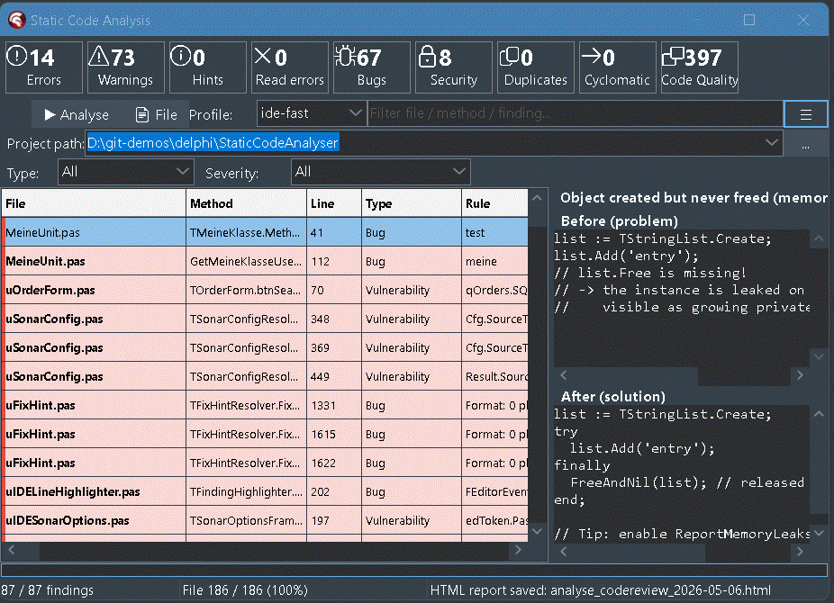
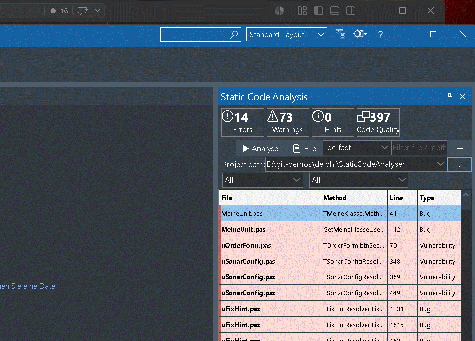
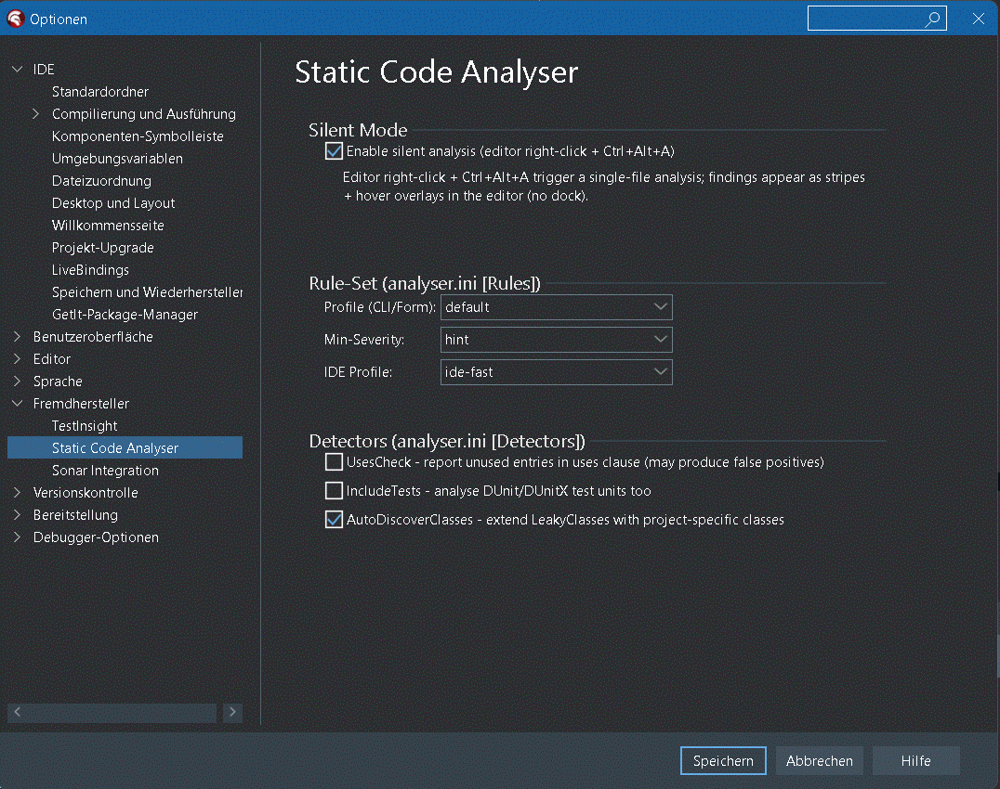

# Static Code Analysis Tool for Delphi

[](https://paypal.me/nrodear)

[](LICENSE)
[](https://paypal.me/nrodear)

> Wenn dir das Plugin bei deiner Delphi-Arbeit Zeit spart, freue ich mich über einen Kaffee. 🙏

---

**Statisches Code-Analyse-Tool** und **Linter** für **Delphi 12 / RAD Studio (Athens)** —
als **IDE-Plugin** mit dockbarem Tool-Fenster plus **eigenständige Windows-Anwendung**.
AST-basierte Analyse mit **insgesamt ~165 Detektoren**: ~143 Pascal-Checks für
Speicherlecks, SQL-Injection, Code-Smells, Sicherheitslücken und Code-Duplikate
(inklusive einer **Sonar-Delphi-kompatiblen** Teilmenge SCA060+),
**plus ein dedizierter DFM-Scanner mit 22 Checks** auf Basis eines eigenen DFM-Lexers
+ Parsers + Komponentengraph, verheiratet mit dem Pascal-AST — tote Event-Handler,
Klartext-DB-Credentials in Form-Dateien, zirkuläre Master-Detail-Verkettung,
Required-Felder ohne UI-Bindung, SQL aus `TEdit.Text`, Cross-Form-Kopplung und mehr.
Sonar-Style-Klassifikation mit Quality Score. Repo-weiter Form-Index für Cross-Unit-
Analyse. VCS-Diff-Modus behandelt `.dfm`-Änderungen als Trigger für die zugehörige
`.pas`. HTML-Report mit gruppiertem `.pas`+`.dfm`-Filter. IDE-Plugin öffnet
DFM-Befunde direkt als Text im Code-Editor. Ein Klick auf einen Befund kopiert
einen AI-fertigen Markdown-Fix-Prompt in die Zwischenablage. Open Source,
MIT-lizenziert.

🇬🇧 [English version](README.md)


---

## Was dieses Plugin kann

In einem Satz: **Sonar-Funktionalität für Delphi-Projekte ohne Sonar-Setup,
direkt in der IDE, mit Claude-AI-Anbindung.**

| Fähigkeit | Wie genutzt |
|-----------|-------------|
| 🐛 **Bugs finden** | ~143 Pascal-Detektoren laufen über jede `.pas`-Datei (MemoryLeak, NilDeref, DivByZero, FormatMismatch, MissingRaise, RoutineResultUnassigned, CharToCharPointerCast, UnpairedLock, GetMemWithoutFreeMem, PointerArithmeticOnString, …) plus 22 DFM-Detektoren über jede `.dfm` (tote Event-Handler, Klartext-DB-Credentials, zirkuläre Master-Detail-Verkettung, …) — **insgesamt ~165** |
| 🔐 **Sicherheitslücken** | SQLInjection (Score-basiert), HardcodedSecret, HardcodedPath |
| 🧹 **Code-Smells** | LongMethod, MagicNumber, EmptyExcept, MissingFinally, DeadCode, DuplicateString/Block |
| ⚡ **Inkrementell analysieren** | „Branch-Changes"-Button: nur die im Git-/SVN-Branch geänderten Dateien — 200 ms statt 60 s |
| 🤖 **Claude-AI-Prompt** | Klick auf Befund → vollständiger Markdown-Block mit Code-Kontext + Vorher/Nachher in der Zwischenablage |
| 📊 **Sonar-Style-Dashboard** | Stat-Tiles über dem Grid: Fehler / Warnungen / Hinweise / Bugs / Vulnerabilities / Codequalität-Score |
| 🎯 **Filtern & Sortieren** | Severity-Combo, Type-Combo, Live-Such-Edit, klickbare Spalten-Header |
| 📤 **Exportieren** | CSV, JSON, HTML-Report, Jira-Wiki-Markup, Clipboard mit Vorher/Nachher |
| 🔇 **Suppression** | `// noinspection MemoryLeak` pro Zeile + `ignore.txt` für ganze Dateien |
| 🌓 **Theme-aware** | Folgt automatisch dem aktiven IDE-Theme (Light/Dark/Mountain Mist/Carbon) |
| 💡 **Vorher/Nachher-Hilfe** | Pro Detektor ein Code-Beispiel "wie es falsch aussieht" + "wie es richtig aussieht" im Help-Panel |

---

## Hauptfeatures

### 1. Statische Code-Analyse (insgesamt ~165 Detektoren — ~143 Pascal + 22 DFM, Sonar-Taxonomie)

**Pascal-AST-Checks (~130)**: **Bugs** (MemoryLeak, NilDeref, DivByZero,
FormatMismatch, ReversedForRange, SelfAssignment, VirtualCallInCtor,
MissingRaise, RoutineResultUnassigned, ReRaiseException,
InstanceInvokedConstructor, CharToCharPointerCast, UnicodeToAnsiCast,
DateFormatSettings, IfThenShortCircuit, …), **Vulnerabilities**
(SQLInjection, HardcodedSecret, DisabledTlsVerification),
**Security Hotspots** (HardcodedPath, HttpInsteadOfHttps), **Code Smells**
(LongMethod, MagicNumber, DeadCode, EmptyExcept, MissingFinally,
CastAndFree, NilComparison, InheritedMethodEmpty, RaisingRawException,
~60 SonarDelphi-kompatible Naming-/Formatting-Checks SCA060-SCA131, …)
und **Code Duplication** (DuplicateString, DuplicateBlock).

**DFM-Checks (22)** auf Basis eines eigenen Form-Datei-Lexers +
Parsers + Komponentengraph, gekoppelt mit dem Pascal-AST via FormBinder:
tote Event-Handler, Klartext-DB-Credentials in Form-Dateien, zirkuläre
Master-Detail-Verkettung, Required-Felder ohne UI-Bindung, SQL aus
`TEdit.Text`, Cross-Form-Kopplung, doppelte Steuer-Hotkeys, nicht
übersetzte Caption-Strings und mehr. Repo-weiter Form-Index für
Cross-Unit-Analyse.

Jeder Befund kommt mit einer Vorher/Nachher-Lösung im Hilfe-Panel.

### 2. Inkrementelle VCS-basierte Analyse (Git + SVN)

Statt das ganze Projekt zu scannen genügt **ein Klick auf `Branch-Changes`**:
der Analyser holt sich via `git diff` bzw. `svn status` die im Branch
geänderten `.pas`-Dateien und analysiert nur diese. **~200 ms statt 60 s**
bei einem typischen Feature-Branch — ideal als Pre-Commit-Check.
Konfigurierbar via `analyser.ini`. Details: [BRANCH_CHANGES_de.md](BRANCH_CHANGES_de.md).

### 3. AI-Integration (Claude-Prompt per Klick)

Klick auf eine Befund-Zeile im Grid → ein **vollständiger Markdown-Prompt**
landet in der Zwischenablage: Befund-Metadaten, Code-Kontext (±5 Zeilen
mit Marker auf der Befund-Zeile), Vorher/Nachher-Lösung. **Strg+V im
Claude-Chat** — und Claude bekommt genug Kontext um den Fix konkret
vorzuschlagen.

---

## Anwendungsfälle nach Deployment-Variante

Die gleiche Analyse-Engine kommt in **drei Formen** — jede für einen
anderen Workflow. Wahl nach Rolle / Tageszeit:

| Anwendungsfall | IDE-Plugin | Standalone EXE (GUI) | CLI (dieselbe EXE) |
|---|:---:|:---:|:---:|
| **Inline-Review beim Coden** — Bug/Vuln-Marker neben der gerade geschriebenen Zeile | ✅ Live-Grid + 3 px Editor-Stripe + Hover-Overlay | — | — |
| **Quick-Fix für die aktuelle Zeile** — Patch-Vorschlag direkt anwenden | ✅ `Strg+Alt+F` | — | — |
| **Befund-Navigation per Tastatur** | ✅ `Strg+Alt+↑/↓` zwischen Befunden | Grid + Pfeiltasten | — |
| **False-Positive auf dieser Zeile unterdrücken** | ✅ `Strg+Alt+S` fügt `// noinspection RuleName` ein | manuell | manuell |
| **Befund an Claude AI übergeben** — Markdown-Prompt mit Code-Kontext | ✅ Zeilen-Klick → Clipboard | ✅ Zeilen-Klick → Clipboard | — |
| **Nur Branch-Changes** — Dateien seit `main` / aktuellem SVN-Diff | ✅ Branch-Button | ✅ Branch-Button | ✅ `--branch` oder `--diff <ref>` |
| **Projekt außerhalb von Delphi analysieren** (kein RAD installiert / Batch-Maschine) | — | ✅ Ordner wählen, Start klicken | ✅ `analyser.exe <ordner>` |
| **Als Pre-Commit-Hook ausführen** | — | — | ✅ `--min-severity error --quiet --fail-on error`, Exit-Code reflektiert Severity |
| **In CI / GitHub Actions ausführen** | — | — | ✅ `--report-sarif sca.sarif`, SARIF-Upload-Step |
| **Befunde an SonarQube / SonarCloud pushen** | ✅ `Tools → Sonar Push` | ✅ Export → Sonar | ✅ `--sonar-export sca-findings.json --sonar-host <url> --sonar-token <t>` |
| **HTML-Report generieren** für Stakeholder / Jira-Anhang | ✅ Export → HTML | ✅ Export → HTML | — |
| **Claude-Review-Prompt** für gesamten Batch (Tech-Lead-Workflow) | ✅ Export → Claude-Prompt | Zeilen-Klick → Clipboard | — |
| **CSV / JSON / Jira-Export** der Befunde | ✅ Export-Menü | ✅ Export-Menü | ✅ (CSV/JSON via Switches) |
| **Nightly Full-Repo-Scan** + Diff gegen Baseline | — | ✅ Task Scheduler | ✅ `cron` / `schtasks` |
| **Auto-Analyse beim Speichern** (Live-Watch) | ✅ opt-in, siehe [Live-Watch](#live-watch-nur-ide-plugin--%EF%B8%8F-riskant) | — | — |
| **Custom-Rules editieren** (RegEx via `[CustomRules]`-ini) | ✅ Tools → Options | ✅ Einstellungsdialog | `analyser.ini` direkt editieren |
| **Detektor-Schwellwerte konfigurieren** (`LongMethod_MaxLines`, …) | ✅ Einstellungen | ✅ Einstellungen | `analyser.ini` editieren |
| **UI-Sprache umschalten** (EN / DE) | ✅ Tools → Options | ✅ Einstellungen | n/a (CLI nur EN) |
| **Rule-Set-Profil wählen** (`ide-fast`, `default`, `strict`) | ✅ Profile-Combo | ✅ Profile-Combo | ✅ `--profile <name>` |
| **Konfigurierbare Tastenkürzel** (cnpack-Stil: Key drücken → in INI gespeichert) | ✅ Einstellungen → Hotkeys | — | — |

### Welche Variante für welche Rolle

**Entwickler an der Tastatur** → IDE-Plugin. Engste Feedback-Schleife:
Inline-Marker, Jump-to-Line, Quick-Fix-in-place, Strg+Alt-Navigation,
Clipboard-an-Claude. Das Plugin nutzt die GLEICHE Engine + den
gleichen Regel-Katalog + die gleichen FixHints wie die anderen zwei —
was im IDE auftaucht, taucht auch in CI auf.

**Code-Reviewer / Tech-Lead ohne offene RAD-Studio-Instanz** →
Standalone-GUI. Gleiches Grid, gleicher Filter, gleiches Help-Panel
wie das Plugin, läuft aber auf einem Ordner mit `.pas`+`.dfm` ohne
laufende IDE. Nützlich für: Review auf einer anderen Maschine,
Overnight-Batch auf einem Build-Server ohne Delphi-Lizenz, EXE an
Nicht-Delphi-Engineer für einmaliges Audit weitergeben.

**CI-Pipeline / Pre-Commit-Hook / Scheduled Task** → CLI-Mode derselben
EXE. Keine GUI, Exit-Code reflektiert Severity über `--fail-on <level>`
(0 = sauber / unter Schwelle, 1 = Schwelle überschritten). CLI-Exporte:
SARIF (`--report-sarif <file>`) für GitHub Code-Scanning / Azure
Pipelines, Sonar-Generic-JSON (`--sonar-export <file>`) für den
SonarQube-Import. HTML- und Claude-Prompt-Export sind GUI-only.
Branch-Changes-Filter (`--branch` für git-Branch vs `main`, oder
`--diff <ref>` für beliebige Basis) lässt PR-Builds nur das
analysieren, was der Diff betrifft.

**Alle drei Modi** lesen die gleiche `analyser.ini`, das gleiche
`rules/sca-rules.json`, die gleichen Suppression-Marker — und emittieren
die gleichen Finding-Kinds. Umschalten zwischen den Modi ist
kostenlos — ein im IDE unterdrückter Befund bleibt auch in CI unterdrückt.

---

## Quick-Start

1. Plugin bauen **und installieren**: `StaticCodeAnalyserIDE\StaticCodeAnalyserIDE.dpk`
   öffnen → **Build** → anschließend **Install** (Rechtsklick auf das Paket
   im Project Manager → **Install**, oder Menü **Component → Install Packages**
   → Paket auswählen). Ohne den Install-Schritt bleibt das Plugin nur
   kompiliert, taucht aber nicht im Menü der IDE auf.
2. In Delphi: **Ansicht → Static Code Analysis Tool for Delphi** → dockbares Fenster erscheint
3. Projektpfad wählen → **Analyse starten**

Für inkrementelle Analyse nur der im Branch geänderten Dateien siehe
[BRANCH_CHANGES_de.md](BRANCH_CHANGES_de.md).

---

## Sonar-Integration

SCA-Findings können als **External Issues** in SonarQube / SonarCloud
gepusht werden (komplementär zu [SonarDelphi](https://github.com/integrated-application-development/sonar-delphi)
— unsere Findings sind mORMot-aware, decken DFM-Files ab und bringen
sonar-fremde Checks wie `TautologicalBoolExpr`, `ConcatToFormat`,
`WithStatement` mit).

```powershell
# Einmalig konfigurieren (IDE: Tools > Optionen > Sonar Integration, oder CLI):
analyser.exe --sonar-test `
  --sonar-host http://localhost:9000 `
  --sonar-token squ_xxxxx `
  --sonar-project my-delphi-project

# Analyse + Generic Issue Format fuer sonar-scanner
analyser.exe --path . --full --sonar-export sca-findings.json
sonar-scanner   # liest via sonar.externalIssuesReportPaths
```

Jede Rule traegt SonarQube-MQR-Felder (`cleanCodeAttribute` + `impacts`)
damit Findings korrekt im MQR-Dashboard erscheinen. Token-Speicherung im
IDE-Plugin per Windows DPAPI (Current-User-Scope) — keine Klartext-
Secrets in `analyser.ini`.

> **Getestet mit**: SonarQube Community Build 26.5+ (Sonar 10+, MQR-Modus).
> SCA-Findings werden als External Issues über das Generic Issue Format
> importiert und stehen neben den built-in Findings des Default-Quality-
> Profile **Sonar Way** — kein Konflikt, kein Override. Funktioniert sowohl
> mit SonarQube Server als auch SonarCloud.

Volles Setup: [docs/sonar-setup.md](docs/sonar-setup.md). Quick-Reference:
[sonarHowto_de.md](sonarHowto_de.md). Resolver-Reihenfolge:
[docs/sonar-config.md](docs/sonar-config.md).

---

## Was wird erkannt (~165 Detektoren — ~143 Pascal + 22 DFM)

Alle Befunde landen in einer der **5 Sonar-Kategorien**:

| Kategorie | Detektor | Schweregrad |
|-----------|----------|-------------|
| **Bug** | `MemoryLeak` (LeakDetector + FieldLeak) | Fehler / Warnung |
| | `NilDeref` (Nil-Dereferenzierung) | Fehler |
| | `DivByZero` (Division durch Null) | Fehler / Warnung |
| | `FormatMismatch` (Format/Argumente) | Fehler |
| **Vulnerability** | `SQLInjection` (Score-basiert) | Fehler |
| | `HardcodedSecret` (API-Keys, Passwörter) | Fehler |
| **Security Hotspot** | `HardcodedPath` (`C:\…`, `/etc/…`) | Warnung |
| **Code Smell** | `EmptyExcept` (silent swallow) | Warnung |
| | `MissingFinally` (Free außerhalb finally) | Warnung |
| | `DeadCode` (unerreichbar nach exit/raise) | Warnung |
| | `UnusedUses` (optional, default off) | Hinweis |
| | `LongMethod`, `LongParamList` | Hinweis |
| | `MagicNumber` (in if-Bedingungen) | Hinweis |
| | `DebugOutput` (`OutputDebugString` etc.) | Warnung |
| | `DeepNesting` | Warnung |
| | `TodoComment` (TODO/FIXME/HACK) | Hinweis |
| | `EmptyMethod` | Hinweis |
| **Code Duplication** | `DuplicateString` (≥3 mal gleicher Literal) | Hinweis |
| | `DuplicateBlock` (≥ `DuplicateBlockMinLines`, default 8 Zeilen identischer Code) | Hinweis |
| **Lesefehler** | `FileReadError` (Parser hängt / Datei zu groß) | Fehler |

Pro Detektor gibt es ein **Vorher/Nachher-Code-Beispiel** im Hilfe-Panel.
Per Klick auf einen Befund landet ein **Markdown-Block für Claude AI** in
der Zwischenablage.

Die **22 DFM-spezifischen Detektoren** (DFM-DeadEventHandler,
DFM-HardcodedDBCredentials, DFM-CircularMasterDetail,
DFM-MissingRequiredFieldBinding, DFM-SQLFromTEditText …) und ihre
Fix-Hints: siehe [DETECTORS_de.md](DETECTORS_de.md).

Vollständiger Status der 50-Sonar-Pruefregeln: siehe [DETECTORS_de.md](DETECTORS_de.md).

---

## Bedienung

### Buttons (von links nach rechts)

| Button | Funktion |
|--------|----------|
| **Verzeichnis-Auswahl** (`...`) | Projektordner wählen |
| **Einstellungen...** | `analyser.ini` öffnen — VCS-Settings, Custom-LeakyClasses (siehe [BRANCH_CHANGES_de.md](BRANCH_CHANGES_de.md)) |
| **Ignore...** | `ignore.txt` öffnen — Datei-/Verzeichnis-Filter |
| **Analyse starten** | Rekursiver Verzeichnis-Scan |
| **Aktuelle Datei** | Nur die im Editor offene `.pas` |
| **Branch-Changes** | Nur via Git/SVN geänderte Dateien (siehe [BRANCH_CHANGES_de.md](BRANCH_CHANGES_de.md)) |
| **Abbrechen** | Bricht laufende Analyse ab |



### Detektor-Konfiguration

In der Toolbar gibt es keine Toggle-Checkboxen mehr — alles optionale
Detektor-Verhalten wird über `analyser.ini` konfiguriert (siehe
_Konfigurations-Dateien_ unten). Datei via **Einstellungen…**-Button
öffnen, anpassen, speichern, **Analyse starten** klicken. Settings
werden bei jedem Lauf neu geladen, kein IDE-Neustart nötig.

### Stat-Cards

Zwei Cards oben zeigen die Verteilung der Befunde:

- **Probleme nach Schweregrad**: Fehler / Warnungen / Hinweise / Sicherheitsrisiken / Lesefehler
- **Probleme nach Typ**: Code Smell / Bug / Vulnerability / Security Hotspot / Code Duplication / Lesefehler

Beide Totals stimmen mathematisch überein.

### Filter

- **Severity-/Type-Combo**: filtert das Grid auf eine Kategorie
- **Profile-Combo**: schaltet das aktive Rule-Set live um. Mitgeliefert:
  `ide-fast` (Plugin-Default — nur Bugs + Vulns), `default` (alle
  Detektoren), `strict` (alle + `UnusedUses`), `security` (Vulns +
  Hotspots), `bugs-only`, `code-quality`, `dfm-only`. Profile leben in
  `rules/sca-rules.json` unter `profiles` und die Combo wird daraus
  gefüllt — eigene Profile dort eintragen, erscheinen automatisch.
  Auswahl wird in `[Rules] IdeProfile` persistiert und greift beim
  nächsten Analyse-Lauf.
- **Such-Edit** (`Datei / Methode / Befund filtern`): live-Filter über alle Spalten

### Grid-Interaktion

| Aktion | Wirkung |
|--------|---------|
| **Klick auf Zeile** | Befund als Markdown-Prompt in Zwischenablage (für Claude AI) **und** — wenn die Datei in der IDE offen ist — wird ein 3-px-roter Streifen am linken Rand der zugehörigen Zeile im Editor gezeichnet |
| **Doppelklick** | Datei in IDE öffnen, zur Befund-Zeile springen, Zeilen-Marker setzen |
| **Hover (Datei-Spalte)** | Tooltip mit vollem Datei-Pfad (100 ms Delay) |
| **Klick auf Spalten-Header** | Sortierung |
| **3-px-Indikatorleiste links** der Grid-Zeile | Severity-Akzent (rot/orange/grün/blau) |

Das **Hilfe-Panel** rechts mit den Vorher/Nachher-Code-Blöcken wird nur
im **Floating-Modus** angezeigt — wenn das IDE-Plugin-Fenster in eine
Side-Bar oder einen Tab gedockt ist, blendet sich das Panel aus und
das Grid bekommt die volle Breite (kommt innerhalb von ~250 ms nach
dem Loslösen wieder zurück).



### Export

| Button | Format | Inhalt |
|--------|--------|--------|
| **JSON** | `.json` | Alle Befunde als Array |
| **CSV** | `.csv` | Excel-tauglich (Semikolon-getrennt) |
| **HTML-Report** | `.html` | Self-contained Report mit Sortierung, Filter, Code-Snippets, Vorher/Nachher. Klick auf eine Severity-Kachel filtert — und blendet zusätzlich Dateien im Dropdown aus, die keine Befunde dieser Severity haben (mit dem Datei-Filter UND-verknüpft) |
| **Jira** | Clipboard | Wiki-Markup für Jira-Tickets (gefiltert auf Datei) |
| **Clipboard** | Clipboard | Plain-Text mit Vorher/Nachher (gefiltert auf Datei) |

### File-Findings-Panel (Per-Datei-Dock)

Ein zweites dockbares Fenster, das sich auf die **aktuell aktive Editor-
Datei** konzentriert. Öffnen über **Ansicht → Static Code Analysis - File**.
Für seitliches Andocken neben dem Editor gedacht, damit die Befunde der
gerade bearbeiteten Datei immer sichtbar sind.

| Eigenschaft | Verhalten |
|---|---|
| **Trigger** | Scant die aktive Editor-Datei beim Öffnen und bei jedem Tab-Wechsel automatisch. Kein „Aktuelle Datei"-Klick nötig |
| **Live-Update** | Wenn der Watch-Mode aktiv ist, lösen Save/Edit den Re-Scan auch hier aus |
| **Grid-Spalten** | Method / Line / Type / Rule / Severity (Rule stretcht; Severity-Akzentbalken links neben jeder Zeile) |
| **Filter** | Combo mit *All severities* / *Errors only* / *Errors + Warnings* |
| **Sortierung** | Klick auf einen Spalten-Header sortiert (Toggle auf-/absteigend) |
| **Klick auf Zeile** | Springt zur Befund-Zeile im Editor (soft navigate, schließt/öffnet die Datei nicht) |
| **.pas + .dfm** | Werden als ein Scan-Ziel behandelt — Tab-Wechsel zwischen beiden lässt die Befunde sichtbar |
| **Positions-Memory** | Öffnet sich an der letzten Position (session-persistent via `analyser.ini`, sessionübergreifend via IDE Save Desktop). Fallback: zentriert über dem IDE-Hauptfenster, wenn nichts gespeichert oder Position off-screen |
| **Theme + Font** | Folgt dem aktiven IDE-Theme (hell/dunkel/Custom) und der Plugin-Schrift (Segoe UI 8) |

---

## Sprache / Lokalisierung

Die UI-Quellsprache ist **Englisch**. UI-Strings sind mit dem `_('…')`-
Makro aus `uLocalization.pas` gewrappt, das bei aktivem dxgettext
(GNU gettext für Delphi) zur Übersetzung weiterleitet.

### Sprache umschalten

| Zustand | Effekt |
|---------|--------|
| **Default (kein dxgettext)** | UI zeigt die Quellstrings direkt — Englisch |
| **dxgettext aktiv, kein `SetLanguage` aufgerufen** | UI folgt System-Locale via `gnugettext.UseLanguageFromSysLocale` |
| **`uLocalization.SetLanguage('de')`** | UI wechselt auf Deutsch via `i18n/de.po` |
| **`uLocalization.SetLanguage('fr')`** | UI wechselt auf Französisch via `i18n/fr.po` |
| **`uLocalization.SetLanguage('en')`** | UI auf Englisch erzwingen |

Sprache beim Start setzen — in `TAnalyserDockableForm.FrameCreated`
(IDE-Plugin) oder im Standalone-`TForm2.FormCreate` aufrufen:

```pascal
uses uLocalization;

SetLanguage('de');   // 'de' / 'en' / 'fr' / '' (= System-Default)
```

### Wo die Übersetzungen liegen

| Pfad | Zweck |
|------|-------|
| `i18n/template.pot` | Quell-Template (Englisch) |
| `i18n/de.po` | Deutsche Übersetzung |
| `i18n/fr.po` | Französische Übersetzung |
| `i18n/en.po` | Englischer Identity-Baseline |
| `locale/<lang>/LC_MESSAGES/default.mo` | Compiled Binary, zur Laufzeit geladen |

Die `.po`-Dateien sind Klartext und Git-freundlich; mit
[poEdit](https://poedit.net/) oder einem normalen Editor bearbeiten.

### dxgettext aktivieren (einmalig)

Ohne installiertes dxgettext ist der Wrapper Passthrough — jeder `_()`-
Aufruf gibt den Quellstring unverändert zurück. Die UI bleibt Englisch,
egal mit welchem Argument `SetLanguage` gerufen wird.

Um echte Übersetzungen zu bekommen:

1. <https://github.com/sjrd/dxgettext> klonen
2. Den `dxgettext/Source/`-Ordner zu `DCC_UnitSearchPath` von IDE-Plugin
   und Standalone-EXE hinzufügen
3. `{$DEFINE USE_GETTEXT}` in der `.dpk` setzen (oder via **Project
   Options → Conditional Defines**)
4. Jede `.po` zu `.mo` kompilieren:
   ```
   msgfmt i18n/de.po -o locale/de/LC_MESSAGES/default.mo
   msgfmt i18n/fr.po -o locale/fr/LC_MESSAGES/default.mo
   ```
5. Den `locale/`-Ordner neben die BPL/EXE legen

Komplette Schritt-für-Schritt-Anleitung: [I18N.md](I18N.md).

---

## Theme-Integration

Das Plugin folgt automatisch dem aktiven Delphi-IDE-Theme:

- **`StyleServices.GetSystemColor`** in Custom-Drawing (OnDrawCell, TTilePanel.Paint)
- **`clBtnFace`/`clWindow`/`clBtnText`** als Property-Werte (auto-themed via VCL Style)
- **`IOTAIDEThemingServices.ApplyTheme`** beim Frame-Hosting
- **`INTAIDEThemingServicesNotifier`** für Live-Theme-Wechsel
- **`CM_STYLECHANGED`** + **`SetParent`-Override** als zusätzliche Trigger

Severity-Hintergrundfarben werden zur Paint-Zeit aus der themed
`clWindow`-Basis + saturierten Akzentfarben gemischt — funktioniert in
jedem Theme ohne separate Light-/Dark-Tabellen.

**Bekannte Limitation**: Im Floating-Modus übernimmt das Plugin-Fenster
IDE-Theme-Wechsel zur Laufzeit nicht zuverlässig (kein offizieller Hook
in `INTACustomDockableForm` für Live-Reapply der Wrapper-Form). Workaround:
Plugin im Dock-Modus betreiben oder Fenster nach Theme-Wechsel schließen
und erneut öffnen.

---

## Verwendung unter Git und SVN

Der Analyser erkennt das VCS-System **automatisch** anhand des Projekt-
Verzeichnisses (sucht nach `.git/` oder `.svn/`-Marker). Custom-Rules
und alle Detektor-Konfigurationen sind **VCS-agnostisch** — derselbe
Workflow funktioniert mit beiden Systemen.

### Auto-Detection

| Marker im Projekt-Pfad | Erkannt als | Genutzte CLI |
|---|---|---|
| `.git/` (oder Eltern-Pfad enthält `.git/`) | Git | `git diff` + `git status` |
| `.svn/` | SVN | `svn status` + `svn diff` |
| keiner | None | `--branch` deaktiviert, `--full` funktioniert |

Ausführbare CLI wird automatisch gesucht in: `PATH`, dann typische
Installations-Pfade (TortoiseGit, TortoiseSVN, Git for Windows, ...).
Override via `analyser.ini` möglich (siehe unten).

### Verwendung mit Git

**Plugin/GUI**: Projekt-Pfad auf den Git-Working-Tree zeigen, dann
**Branch-Changes**-Button. Der Analyser ermittelt:
- Geänderte `.pas`-Dateien zwischen `BaseBranch` und `HEAD` (committed)
- Plus uncommitted Working-Tree-Modifikationen (wenn `IncludeWorkingTree=1`)

**CLI**:
```powershell
analyser.d12.exe --path D:\meinGitRepo --branch --report-sarif sca.sarif

# Optional: Rule-Set ueber Profile + Min-Severity einengen
analyser.d12.exe --path . --profile security --report-sarif sec.sarif
analyser.d12.exe --path . --profile bugs-only --min-severity warning
```

`--profile <name>` akzeptiert jedes Profile aus `rules/sca-rules.json`
(mitgeliefert: `default`, `ide-fast`, `strict`, `security`, `bugs-only`,
`code-quality`, `dfm-only`). `--min-severity hint|warning|error` skippt
Detektoren unterhalb der Schwelle. Beide Flags ueberschreiben `[Rules]`
in `analyser.ini`.

**`analyser.ini`-Settings für Git**:
```ini
[Repo]
BaseBranch=develop          ; leer = auto: origin/HEAD -> main -> master
IncludeWorkingTree=1        ; 1 = uncommitted Aenderungen mit, 0 = nur committed

[Paths]
GitExe=C:\custom\git\bin\git.exe   ; leer = auto-Detection
```

### Verwendung mit SVN

**Plugin/GUI**: identisch zu Git — Working-Copy-Pfad wählen, **Branch-
Changes**-Button. Da SVN kein "echtes" Branch-Konzept im Working-Copy
hat, liefert der Branch-Mode hier:
- Alle uncommitted Änderungen (`svn status`-Output: M/A/R/D/?)
- Auf Wunsch erweitert um committed Differenzen seit BASE-Revision

Ideal als **Pre-Commit-Hook**: prüft genau das, was beim nächsten
`svn commit` ginge.

**CLI**:
```powershell
analyser.d12.exe --path D:\meinSvnWC --branch --report-sarif sca.sarif
```

**`analyser.ini`-Settings für SVN**:
```ini
[Repo]
BaseBranch=trunk            ; SVN: typisch trunk (informativ, da kein echter Diff)
IncludeWorkingTree=1        ; uncommitted Aenderungen mit

[Paths]
SvnExe=C:\custom\svn\bin\svn.exe   ; leer = auto: PATH + TortoiseSVN
```

**Auto-Detection-Pfade für SVN**:
1. `svn.exe` im PATH
2. `C:\Program Files\TortoiseSVN\bin\svn.exe`
3. `C:\Program Files (x86)\TortoiseSVN\bin\svn.exe`
4. `C:\Program Files\Subversion\bin\svn.exe`

### Custom-Rules unter beiden VCS

Die [Custom-Rule-Engine](examples/README.md) (YAML-Profile) ist
unabhängig vom VCS — sie liest nur Dateien. Empfohlener Workflow für
**beide** VCS-Systeme:

1. `analyser-rules.yml` (oder eines der Profile aus `examples/`) ins
   **Projekt-Wurzelverzeichnis** legen — Git/SVN versionieren die Datei mit
2. In `analyser.ini` referenzieren:
   ```ini
   [Detectors]
   CustomRulesFile=analyser-rules.yml   ; relativ zum Projekt-Root
   ```
3. Plugin/GUI lädt automatisch beim nächsten Analyse-Lauf

So pflegt jedes Projekt **sein eigenes Ruleset im Repo** — Team-shared,
versioniert, in Code-Reviews mitchangbar.

### CI/CD-Integration

**GitHub Actions** (Git): siehe Vorlage [`.github/workflows/sca.yml`](.github/workflows/sca.yml).
SARIF-Upload erscheint als Inline-Annotations im PR.

**GitLab CI / Jenkins / TeamCity / Azure DevOps**: identisches Muster —
Tool im Pipeline-Image bereitstellen, `analyser.exe --path . --branch
--report-sarif sca.sarif` aufrufen, Artefakt anhängen oder weiterver-
arbeiten (SARIF-Plugins für die meisten CI-Systeme verfügbar).

**SVN-Pre-Commit-Hook** (Server-side, Linux):
```bash
#!/bin/sh
# /path/to/svn-repo/hooks/pre-commit
REPOS="$1"
TXN="$2"

# Tool-Pfad und Working-Copy-Mirror anpassen
ANALYSER=/opt/sca/analyser.d12.exe
WC=/tmp/sca-precommit-$TXN

svn export "$REPOS" "$WC" -r "$TXN" --quiet
"$ANALYSER" --path "$WC" --full --quiet
EXIT=$?
rm -rf "$WC"
exit $EXIT
```

Exit-Code-Mapping (siehe [Headless CLI](#headless-cli-mode)):
- 0 = clean → commit erlaubt
- 1 = nur Hints → commit erlaubt
- 2 = Warnings → commit erlaubt (oder blockieren via Hook-Logik)
- 3 = Errors → **commit blockiert**

---

## Konfigurations-Dateien

Die meisten Einstellungen lassen sich im IDE-Plugin direkt über
**Tools > Optionen > Fremdhersteller > Static Code Analyser** pflegen
(Live-Preview, theme-aware):



Dieselben Werte werden in die INI-Dateien unten persistiert — frei
wählbar, was bequemer ist. Alle in `%APPDATA%\StaticCodeAnalyser\`:

| Datei | Inhalt |
|-------|--------|
| `analyser.ini` | Alle Settings — VCS (BaseBranch, git/svn-Pfade), Detektor-Toggles (`UsesCheck`, `IncludeTests`, `AutoDiscoverClasses`), Custom-`LeakyClasses` / `ExcludeLeakyClasses`, Detektor-Schwellwerte, UI-Sprache. Wird beim ersten Start mit selbst-dokumentierten Kommentaren neben jeder Option angelegt |
| `ignore.txt` | Datei-/Verzeichnis-Patterns die NICHT analysiert werden |
| `recent.ini` | Zuletzt verwendete Projektpfade |
| `LeakyClassesDiscover.log` | Output von `AutoDiscoverClasses=1` — gefundene Klassen aufgeteilt in _instantiable_ (haben ctor/dtor oder `Create()`-Aufruf) und _static-only candidates_. Relevante manuell in `LeakyClasses=` von `analyser.ini` übernehmen |
| `StaticCodeAnalyser_scan.log` | Diagnose-Log: welche Datei wie lange gebraucht hat |

### Detektor-Schwellwerte (alle optional, in `[Detectors]`)

| Key | Default | Wirkung |
|-----|---------|---------|
| `LongMethodMaxBodyLines` | 50 | `LongMethod` greift wenn Body-Zeilen UND Statement-Anzahl beide über den Schwellen liegen |
| `LongMethodMaxStatements` | 30 | (sekundäre Schwelle für `LongMethod`) |
| `LongParamListMaxParams` | 5 | `> N` Parameter → Refactoring-Hinweis |
| `DeepNestingMaxDepth` | 4 | `> N` verschachtelte Kontroll-Strukturen |
| `CyclomaticMax` | 10 | McCabe-Komplexität `> N` pro Methode (zählt `if`, `case`-Arm, `for`/`while`/`repeat`, `on`-Handler, `and`/`or`/`xor`) |
| `DuplicateBlockMinLines` | 8 | minimale normalisierte Zeilen-Anzahl für Duplikat-Erkennung |
| `MaxFileMB` | 5 | größere Dateien werden übersprungen (OOM-Schutz bei generiertem Code) |
| `MaxLineLength` | 120 | `TooLongLine` schlägt an, wenn eine Zeile diese Laenge ueberschreitet |
| `MaxCaseBranches` | 10 | `CaseStatementSize` schlägt an, wenn ein `case` so viele Branches hat |
| `MagicNumberTrivials` | `0,1,2,-1,10,100` | Zahlen die NICHT als Magic-Number gemeldet werden |
| `UsesCheck` | 0 | `UnusedUses`-Detektor (default off — produziert ggf. false positives) |
| `IncludeTests` | 0 | `uTest*.pas`, `*_Tests.pas`, `TestProject*.dpr`, `/tests/`-Ordner mit-analysieren |
| `AutoDiscoverClasses` | 0 | Projekt-AST nach Custom-Klassen scannen die `Free` brauchen, automatisch zu `LeakyClasses` ergänzen |
| `LeakyClasses` | _(leer)_ | kommagetrennt — zusätzliche Klassen die getrackt werden sollen |
| `ExcludeLeakyClasses` | _(leer)_ | kommagetrennt — Klassen die NICHT getrackt werden sollen, auch wenn sie in den Defaults stehen |

### Live-Watch (nur IDE-Plugin) — ⚠️ RISKY

Klick auf **Aktuelle Datei** im IDE-Plugin aktiviert einen Single-File-Live-Watch
auf genau diese Datei: bei jedem Save (300 ms debounced) und Edit (1000 ms
debounced) laeuft die Analyse fuer DIESE Datei automatisch im Hintergrund-Thread.
Tab-Wechsel auf eine andere Datei aendert nichts; erneuter Klick auf
**Aktuelle Datei** haengt den Watch um. Bulk-Pfade (**Analyse starten**,
**Branch-Changes**) deaktivieren den Watch explizit. Es gibt kein INI-Flag dafuer.

> ⚠️ **Risiko Endlosschleife.** Es existiert heute **kein Re-Entrancy-Guard**
> fuer ueberlappende Worker-Spawns. Wenn der Worker laenger als der Edit-
> Debounce (1000 ms) braucht und der User waehrenddessen weiter tippt, wachst
> der Worker-Backlog statt zu schrumpfen. Zusaetzlich kann (Delphi-version-
> abhaengig) ein Editor-Repaint nach Findings-Update wieder als `Modified`
> interpretiert werden — Edit-/Save-Pfad koennen sich dann gegenseitig
> nachtriggern. Heute geschuetzt nur durch den Generation-Counter (verwirft
> _spaete_ Ergebnisse, verhindert aber keinen ueberlappenden Spawn). Vor
> breitem Einsatz unbedingt erst Re-Entrancy-Guard + Hard-Cap einbauen
> (`TODO.md` -> _Single-File-Live-Watch_).

---

## Suppression

Einzelne Befunde im Code unterdrücken:

```pascal
// noinspection MemoryLeak
list := TStringList.Create;

// noinspection NilDeref, DivByZero
DoSomethingRisky;

// noinspection All
// alle Pruefungen fuer die naechste Zeile
```

Erkannte Kategorien (eine pro registriertem Detektor — Single source of
truth ist `KIND_META` in `uSCAConsts.pas`):

`MemoryLeak`, `EmptyExcept`, `SQLInjection`, `HardcodedSecret`,
`FormatMismatch`, `FileReadError`, `UnusedUses`, `NilDeref`,
`MissingFinally`, `DivByZero`, `DeadCode`, `LongMethod`, `LongParamList`,
`MagicNumber`, `DuplicateString`, `HardcodedPath`, `DebugOutput`,
`DeepNesting`, `TodoComment`, `EmptyMethod`, `DuplicateBlock`, `All`.

---

## Ownership-Transfer (kein MemoryLeak-Befund)

Folgende Muster werden als Ownership-Übergabe erkannt:

| Muster | Bedeutung |
|--------|-----------|
| `Result := varName` | Funktion gibt Ownership an Aufrufer ab |
| `varName.Parent := winControl` | VCL: TWinControl gibt seine `Controls[]` frei |
| `varName := X.Add(...)` | Borrowed-Return — Item lebt in der `OwnsObjects`-Liste |
| `varName := X.AddChild(...)` | AST-/DOM-Tree: Child gehört dem Parent |
| `varName := X.AddNode(...)` | TTreeView etc. |
| `varName := X.AppendChild(...)` | XML-DOM / IXMLNode |
| `FField := varName` | Var-zu-Feld: Ownership verlässt Method-Scope |
| `FField := varName as ISomething` | Interface-Refcount hält das Objekt am Leben |
| `inherited Create(varName, …)` | Elternkonstruktor übernimmt |
| `TAnyClass.Create(varName, …)` | Anderer Konstruktor übernimmt |
| `Container.Add(varName)` | TObjectList o.ä. übernimmt |
| `Container.Add(key, varName)` | TObjectDictionary übernimmt |
| `Container.AddObject(text, varName)` | TStringList mit Objekten |
| `Container.Insert(i, varName)` | TList.Insert |
| `Container.Push(varName)` | TStack.Push |
| `Container.Enqueue(varName)` | TQueue.Enqueue |

Für **Klassen-Felder** kennt der FieldLeak-Detektor zusätzlich das
Standard-TComponent-Owner-Pattern als kein-Leak:

| Muster | Bedeutung |
|--------|-----------|
| `FField := X.Create(Self)` | TComponent-Owner: `inherited Destroy` ruft `DestroyComponents` |
| `FField := X.Create(AOwner)` | Owner aus Konstruktor-Parameter weitergereicht |
| `FField := X.Create(Owner)` | Owner aus existierendem Feld/Property |

---

## Architektur

```
StaticCodeAnalyserIDE/                 IDE-Expert Paket (.dpk)
  uIDEExpert.pas                       Wizard-Registrierung (IOTAMenuWizard)
  uIDEAnalyserForm.pas                 Dockbares Fenster (TFrame) - Hauptshell:
                                       Filter, Stats-Grid, Sort, Export,
                                       Claude-Prompt-Copy, Lifecycle-Sentinel
  uIDELineHighlighter.pas              3 px roter Streifen im IDE-Editor-
                                       Gutter auf der Befund-Zeile
  uIDEMessages.pas                     Hand-off in den IDE-Messages-Tab
  uIDEWatchMode.pas                    Single-File-Live-Watch (Aktuelle Datei)
                                       Save 300 ms / Edit 1000 ms debounced
                                       ⚠️ kein Re-Entrancy-Guard - s. README
  uIDEStatsTiles.pas                   Sonar-Style Tile-Reihe Builder
  uIDEHelpPanel.pas                    Rechtes Help-Panel mit Vorher/Nachher,
                                       auto-hide im Docked-Modus
  uIDEExportMenu.pas                   Export-Dropdown (JSON/CSV/HTML/Jira)
  uIDEEditorIntegration.pas            ToolsAPI-Wrapper: aktuelle .pas-Datei,
                                       Project-Dir, OpenFileAtLine
  uIDEStatusBar.pas                    Drei-Panel-Statusleiste
                                       (Findings / Progress / Mode)
  uIDEThemeIntegration.pas             IDE-Theme-Notifier + ApplyTheme-Refresh
  uIDEAnalyseProgress.pas              Busy-State-Controller
                                       (Begin/EndRun, Cancel-Flag)

StaticCodeAnalyserForm/sources/        Analyse-Engine (shared zwischen Standalone + IDE-Plugin)
  Common/
    uSCAConsts.pas                     TFindingKind + KIND_META Single source
                                       of truth (Sonar-Kategorie-Mapping)
    uMethodd12.pas                     TLeakFinding-Record + Helpers
    uRecentPaths.pas                   recent.ini-Verwaltung
    uRegExMatches.pas                  Geteilte RegEx-Helpers
    uDetectorUtils.pas                 IsIdentChar, IsWholeWord-Helpers
    uCollectValues.pas                 AST-Literal-Wert-Sammlung

  UI/
    uAnalyserPalette.pas               Zentrale Farb-Konstanten
    uAnalyserTypes.pas                 TFindingSeverity-Enum + Konversion
    uAnalyserTheme.pas                 SeverityBg, SeverityAccent, BlendColor
    uFindingGridRenderer.pas           StringGrid-OnDrawCell-Logik
    uFindingFilter.pas                 Severity/Type/Search-Filter-Pipeline
    uLocalization.pas                  dxgettext-Wrapper (_('…')-Makro)

  Parsing/
    uLexer.pas                         Tokenizer, Watchdog (200k Token)
    uParser2.pas                       Recursive-Descent-Parser mit
                                       Forward-Progress-Garantie
    uAstNode.pas                       AST mit FindAll/FindFirst-Suche

  Infrastructure/
    uStaticAnalyzer2.pas               Orchestriert ~130 Pascal-Detektoren pro Datei
    uStaticFiles.pas                   Rekursiver Datei-Scan, Tick-Callback,
                                       Cancel-Support, Symlink-Schutz
    uIgnoreList.pas                    ignore.txt + Test-Filter
    uVcsChanges.pas                    Git/SVN-Diff via CreateProcess+Pipe
    uRepoSettings.pas                  analyser.ini (BaseBranch etc.)
    uSuppression.pas                   // noinspection-Marker
    uExport.pas                        JSON / CSV / Jira / Clipboard
    uExportHtml.pas                    Self-contained HTML-Report

  Output/
    uClaudePrompt.pas                  AI-Markdown-Prompt-Generator
    uFixHint.pas                       Vorher/Nachher pro Befund-Typ

  Detectors/
    uLeakDetector2.pas                 MemoryLeak (Local-Var, AST-basiert)
    uFieldLeak.pas                     Class-Field-Leak (Create/Destroy)
    uCodeSmells2.pas                   EmptyExcept
    uSQLInjection.pas                  + uSQLInjectionScore.pas (Scoring)
    uHardcodedSecret.pas, uHardcodedPath.pas
    uFormatMismatch.pas, uUnusedUses.pas
    uNilDeref.pas, uMissingFinally.pas
    uDivByZero.pas, uDeadCode.pas
    uLongMethod.pas, uLongParamList.pas
    uMagicNumbers.pas, uDuplicateString.pas
    uDuplicateBlock.pas
    uDebugOutput.pas, uDeepNesting.pas
    uTodoComment.pas, uEmptyMethod.pas
    uCustomClassDiscovery.pas          AutoDiscoverClasses-Helper
                                       (kein Detektor - speist LeakyClasses)
```

### Datenfluss

```
Datei → Lexer → Parser2 → AST (TAstNode)
                              │
                              ├── 21 Detektoren parallel (try-except pro Detector)
                              │       jeder produziert TLeakFinding
                              │
                              └── TSuppression filtert noinspection-Markierungen
                                          │
                                          └── TObjectList<TLeakFinding>
                                                  │
                                                  └── PopulateFindings →
                                                      Stats-Cards + Grid + Export
```

---

## Performance

Bei einem typischen 1000-Unit-Repo:

| Phase | Pro File | 1000 Files |
|-------|----------|------------|
| Verzeichnis-Scan | — | 1-3 s |
| Lexer | ~5-15 ms | ~10 s |
| Parser2 | ~10-50 ms | ~30 s |
| ~130 Pascal-Detektoren | ~10-60 ms | ~50 s |
| DFM-Parser + 22 DFM-Detektoren (pro `.dfm`) | ~5-20 ms | ~5-10 s |
| Suppression-Sweep | — | <1 s |
| **Gesamt** | **~30-100 ms** | **~60-90 s** |

**Für inkrementelle Re-Scans nur Branch-Änderungen** statt Voll-Scan
benutzen — typisch 200 ms bis 3 s. Siehe [BRANCH_CHANGES_de.md](BRANCH_CHANGES_de.md).

### Robustheit

- **Watchdog**: 200k Token-Limit pro Datei → pathologische Inputs werden
  nach <1 s abgebrochen (statt zu hängen)
- **GuardAdvance**: Forward-Progress-Garantie in allen Outer-Parser-Loops
- **Real-world Delphi-Syntax-Abdeckung**: der Parser handhabt
  `interface`-Typdeklarationen, Generics (`TFoo<T>`, `function Get<T>: T;`),
  `packed record` / `packed class`, lokale `label`-Sektionen,
  `record helper for X` / `class helper for X` und IFDEF-konditionale
  Method-Header, ohne dabei Methodenrümpfe zu verlieren — wichtig für
  real-world Codebases (mORMot2 usw.).
- **`MaxFileMB` (default 5 MB)**: größere Files sofort als `FileError`
  gemeldet. Konfigurierbar in `analyser.ini`.
- **MAX_DEPTH = 32**: Symlink-Endlosschleifen-Schutz
- **Cancel jederzeit**: EAbort propagiert sauber durch alle Schichten
- **Pro-Detektor try/except**: ein abstürzender Detektor blockiert
  nicht die anderen 40

---

## Test-Projekte

```
StaticCodeAnalyserForm/tests/
  TestProject.dpr                      DUnitX-Konsolen-Runner
  uTestAnalyserChecks.pas              ~290 Tests in 26 Fixtures
                                       (1 Fixture pro Detektor)
  uTestTAstNode.pas                    AST-Helper-Tests
  uTestPerformance.pas                 Throughput-Benchmarks
                                       (Tokens/ms, Lines/ms)
```

Tests laufen mit DUnitX. Im Console-Modus erzeugt das Testprojekt einen
NUnit-XML-Report — CI-tauglich.

---

## Voraussetzungen

- Delphi 12 (Athens)
- DUnitX (nur fuer die Testsuite, nicht fuer das Plugin selbst)
- Optional: Git for Windows oder TortoiseSVN **mit** CLI-Tools fuer das
  Branch-Changes-Feature

### Build-Ziele

| Ziel | Win32 | Win64 |
|------|-------|-------|
| **IDE-Plugin** (`StaticCodeAnalyserIDE.dpk`) | ✅ Pflicht | ❌ — muss 32-Bit bleiben, weil die RAD-Studio-12-IDE selbst 32-Bit ist und Plugins die Bitness erben |
| **Standalone-EXE / CLI** (`analyser.d12.dproj`) | ✅ | ✅ |
| **Test-Suite** (`TestProject.dproj`) | ✅ | _Plattform bei Bedarf hinzufuegen_ |

Die Standalone-EXE kompiliert sauber sowohl fuer `Win32` als auch
`Win64` — beide Ziele laufen durch dieselbe Detektor-Engine und
liefern dieselben SARIF-/JSON-/CSV-/HTML-Reports. `Win64` waehlst du,
wenn du einen groesseren Heap brauchst (relevant nur bei
Multi-GB-Scans).

---

## Komponenten-Übersicht

| Komponente | Pfad | Zweck |
|------------|------|-------|
| **Standalone-EXE** | `StaticCodeAnalyserForm/analyser.d12.dproj` | Verzeichnis-/Datei-Scan außerhalb der IDE |
| **IDE-Plugin** | `StaticCodeAnalyserIDE/StaticCodeAnalyserIDE.dpk` | Hauptfeature: dockbares Tool-Fenster mit allen Funktionen |

Beide nutzen die gemeinsame Analyse-Engine in `StaticCodeAnalyserForm/sources/`.

---

## Dokumentation

Das Repository enthält drei Markdown-Dokumente. Sie ergänzen sich
inhaltlich, sodass jedes für sich gelesen werden kann:

| Datei | Inhalt | Wann nachschlagen |
|-------|--------|-------------------|
| [README_de.md](README_de.md) | **Übersichts-Doku** — was das Plugin kann, wie es bedient wird, Architektur, Performance, Suppression, Theme-Integration | Erste Anlaufstelle für alle Themen außer den zwei Spezial-Bereichen unten |
| [DETECTORS_de.md](DETECTORS_de.md) | **Kanonische Detektor-Liste** — alle 50 Sonar-Prüfregeln plus 3 Bonus-Detektoren mit Status (✅ implementiert / 🟡 teilweise / 🔲 offen), Beschreibung und zuständiger Unit | Wenn du wissen willst welche Regel implementiert ist, was sie genau prüft, oder welcher Detektor als nächstes drankommt |
| [BRANCH_CHANGES_de.md](BRANCH_CHANGES_de.md) | **VCS-/Branch-Changes-Feature** — wie der `Branch-Changes`-Button funktioniert, Git/SVN-Setup, Tortoise-Kompatibilität, `analyser.ini`-Konfiguration, Troubleshooting für Repo-Erkennung | Wenn der Branch-Changes-Button nicht macht was er soll, oder du das VCS-Setup feinjustieren willst |

Konvention: `README_de.md` ist breit, die anderen zwei sind tief und auf
einen Aspekt fokussiert. Wenn du eine bestehende Section in `README_de.md`
zu groß findest, wird sie typischerweise in eine eigene Spezial-Datei
ausgelagert (so wie es mit dem Branch-Changes-Teil passiert ist).

---

## Verwandte Projekte & Alternativen

Wer dieses Projekt evaluiert, schaut häufig parallel auf:

- **SonarQube / SonarLint** — breite Sprach-Abdeckung, aber
  **Delphi / Object Pascal wird nicht out-of-the-box unterstützt**.
  Dieses Projekt ist der naheliegendste "Sonar-Feel" für Delphi, ohne
  selbst ein Sonar-Plugin schreiben zu müssen. Gleiche fünf Kategorien
  (Bug / Vulnerability / Security Hotspot / Code Smell / Code
  Duplication), gleiche Quality-Score-Idee, SARIF-Export für GitHub
  Code Scanning.
- **FixInsight** (CodeHealer) — kommerziell, IDE-integriert. Dieses
  Projekt ist eine **freie, Open-Source-FixInsight-Alternative** mit
  vergleichbarer Pascal-Detektor-Abdeckung plus dediziertem DFM-Scanner,
  den FixInsight nicht mitliefert.
- **Pascal Analyzer (PAL)** — kommerziell. Überlappendes Detektor-Set,
  aber keine DFM-aware Checks, kein Claude-AI-Hand-off, kein SARIF.
- **DFMCheck / GExperts DFM-Check** — Single-Purpose-DFM-Linter. Die
  22 DFM-Detektoren in diesem Projekt sind eine Obermenge
  (graph-basierte Cross-Form-Analyse, Repo-weiter Form-Index,
  Pascal-AST-Kopplung).
- **DCC32-Hints/Warnings** — eingebaute Compiler-Diagnostik. Nützlich
  aber begrenzt auf syntaktische und trivial-semantische Checks; keine
  Taxonomie, keine AST-Queries, keine Security-Kategorie.

## Schlagwörter

Delphi statische Code-Analyse, Object Pascal Linter, RAD-Studio-Plugin,
Delphi 12 Athens, Delphi-IDE-Plugin, ToolsAPI, DFM-Analyzer,
Formular-Datei-Linter, Pascal AST, SonarQube-Alternative für Delphi,
FixInsight-Alternative, Pascal-Analyzer-Alternative, Delphi
Speicherleck-Detektor, SQL-Injection-Detektor für Delphi, Hardcoded-
Secret-Scanner, Delphi Code-Smell, Delphi Code-Duplication, McCabe-
Komplexität Delphi, SARIF Delphi, Branch-Changes inkrementeller Scan,
Git-Diff Delphi, SVN-Diff Delphi, Claude-AI-Prompt, Delphi-Code-Review-
Automation, TADOQuery-Security, TFDQuery-Security, TClientDataSet-
Provider-Chain, TDataSetProvider-Audit, Master-Detail-Zirkel-Erkennung,
tote Event-Handler erkennen, untranslated Caption Detektor, dxgettext-
Audit, TEdit.Text-SQL-Injection, hardcoded DB-Credentials in DFM,
Pascal Lint CI/CD, GitHub-Actions Delphi SARIF, Pre-Commit-Hook Delphi.

---

## Lizenz

Dieses Projekt steht unter der **MIT-Lizenz** — vollständiger Text in
[LICENSE](LICENSE).

```
Copyright (c) 2026 Nicolas Gerlach
```

Kurz zusammengefasst:

- ✅ Frei nutzbar, kopierbar, modifizierbar, mergen, weiterverteilen und sublizenzieren
- ✅ Auch für kommerzielle Nutzung freigegeben
- ✅ Keine Gewährleistung — Software wird „as is" bereitgestellt
- ℹ️ Copyright-Vermerk und Lizenztext müssen in Kopien oder wesentlichen
  Teilen der Software erhalten bleiben

---

## Unterstützen

Spenden-Link steht oben am Anfang der README — danke!
