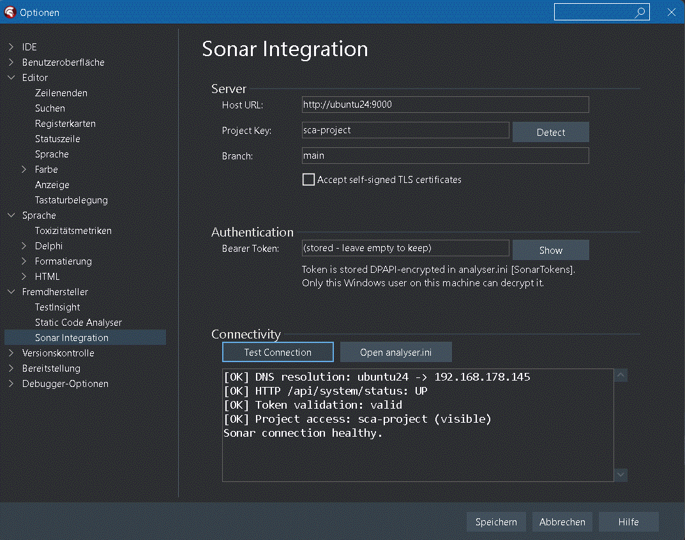

# SonarQube Integration — Setup Guide

StaticCodeAnalyser kann seine Findings als **external issues** an SonarQube /
SonarCloud liefern. Wir konkurrieren nicht mit
[SonarDelphi](https://github.com/integrated-application-development/sonar-delphi) —
unsere Findings (mORMot-Leaks, DFM-Detektoren, sonarfremde Smells wie
`ConcatToFormat` / `TautologicalBoolExpr`) ergänzen den SonarDelphi-Report.

---

## Quick start (lokaler Sonar via Docker)

```powershell
# 1. Sonar starten (siehe sonar-docker-Test.md falls vorhanden)
docker run -d --name sonarqube -p 9000:9000 sonarqube:latest

# 2. Token in Sonar erstellen (Web-UI: User > My Account > Security)

# 3. SCA konfigurieren — entweder Tools>Options im IDE-Plugin
#    oder direkt CLI:
analyser.exe --sonar-test `
  --sonar-host http://localhost:9000 `
  --sonar-token squ_xxxxx `
  --sonar-project my-delphi-project

# 4. sonar-project.properties Template ablegen
analyser.exe --sonar-init --path .

# 5. Analyse + Export
analyser.exe --path . --full --sonar-export sca-findings.json

# 6. Scanner laufen lassen
sonar-scanner
```

Im Sonar-Dashboard erscheinen die SCA-Findings unter Issues als
`external_static-code-analyser:SCA<NNN>` neben den SonarDelphi-Findings.

---

## Konfigurations-Quellen (Priorität)

Vier Quellen, höchste Priorität zuerst — jede Quelle füllt nur Felder die
noch leer sind:

| # | Quelle | Standalone | IDE-Plugin |
|---|---|---|---|
| 1 | CLI-Flags (`--sonar-host`, `--sonar-token`, ...) | ✅ | — |
| 2 | Env-Vars (`SONAR_HOST_URL`, `SONAR_TOKEN`, `SONAR_PROJECT_KEY`, ...) | ✅ | ✅ |
| 3 | Project-Config (`sonar-project.properties` im `--path`) | ✅ | ✅ |
| 4 | User-INI (`%APPDATA%\StaticCodeAnalyser\analyser.ini` `[Sonar]` + `[SonarTokens]`) | ✅ | ✅ |

Token-Speicherung in der INI: **DPAPI-verschlüsselt** (Windows, Current-User-
Scope). Nur derselbe Windows-User auf demselben Rechner kann es entschlüsseln.
Auf Non-Windows (CI/Linux) ist nur der Env-Var-Pfad supported.

### Beispiel `analyser.ini` (Sonar-Section)

```ini
[Sonar]
HostUrl=http://localhost:9000
ProjectKey=my-delphi-project
Branch=
Organization=
Insecure=0
TokenRef=ide-default

[SonarTokens]
; Werte sind DPAPI-Hex (Windows). CLI-/Env-Override umgeht diese Section.
ide-default=01000000d08c9ddf0115d1118c7a00c04fc297eb...
```

### Beispiel `sonar-project.properties` (im Projekt-Root)

```properties
sonar.projectKey=my-delphi-project
sonar.projectName=My Delphi Project
sonar.sources=.
sonar.sourceEncoding=UTF-8
sonar.exclusions=**/*.dcu,**/*.bpl,**/lib/**,**/Win32/**,**/Win64/**

# SCA findings als external issues (Generic Issue Format)
sonar.externalIssuesReportPaths=sca-findings.json
```

---

## CLI Reference

| Flag | Zweck |
|---|---|
| `--sonar-export <file>` | Analyse-Output als Generic Issue JSON schreiben |
| `--sonar-init` | `sonar-project.properties`-Template anlegen |
| `--sonar-test` | Connectivity-Health-Check (DNS → Status → Token → Project) |
| `--sonar-host <url>` | Server-URL überschreiben |
| `--sonar-token <tok>` | Bearer-Token überschreiben (Vorsicht: shell history) |
| `--sonar-project <key>` | Project-Key überschreiben |
| `--sonar-branch <name>` | Branch-Name überschreiben |
| `--sonar-insecure` | Self-signed TLS-Cert akzeptieren |
| `--sonar-config <ini>` | Alternativer `analyser.ini`-Pfad |

`--sonar-test` und `--sonar-init` sind **Standalone-Aktionen** und brauchen
weder `--path` noch `--file`.

### Beispiel Health-Check-Output

```
Sonar config:
  host    = http://localhost:9000   (CLI --sonar-host)
  project = my-delphi-project       (analyser.ini)
  token   = (42 chars from env SONAR_TOKEN)

[OK]   DNS resolution: localhost -> 127.0.0.1
[OK]   HTTP /api/system/status: UP
[OK]   Token validation: valid
[OK]   Project access: my-delphi-project (visible)
Sonar connection healthy.
```

Exit-Code: `0` = healthy, `99` = irgendeine Stufe fehlgeschlagen.

---

## CI/CD-Setups

### GitHub Actions

```yaml
env:
  SONAR_HOST_URL: ${{ secrets.SONAR_HOST_URL }}
  SONAR_TOKEN:    ${{ secrets.SONAR_TOKEN }}
  SONAR_PROJECT_KEY: my-delphi-project
steps:
  - uses: actions/checkout@v4
  - name: Run StaticCodeAnalyser
    run: analyser.exe --path . --full --sonar-export sca-findings.json
  - name: Run sonar-scanner
    uses: SonarSource/sonarcloud-github-action@master
```

### Azure DevOps Pipeline

```yaml
variables:
  SONAR_HOST_URL: $(SonarHostUrl)
  SONAR_TOKEN:    $(SonarToken)
- script: analyser.exe --path $(Build.SourcesDirectory) --full --sonar-export sca-findings.json
- task: SonarCloudPrepare@2
- task: SonarCloudAnalyze@2
- task: SonarCloudPublish@2
```

---

## IDE Plugin

### Tools > Options > Third Party > Sonar Integration

Eine eigene Options-Page mit Host / Project / Token / Branch + Insecure-
Checkbox. **Detect**-Button liest `sonar-project.properties` aus dem
aktuell offenen Projekt. **Test Connection** läuft denselben Health-Check
wie das CLI `--sonar-test` und zeigt das Ergebnis als Checkliste.



### "Sonar: write Generic Issue report..." im Export-Menü

Schreibt alle aktuell **sichtbaren** Findings als eine `sca-findings.json`
in einen vom User gewählten Pfad. Filter im Findings-Grid wirken — wer nur
Errors exportieren will, filtert vorher.

### "Sonar: send selected as external issue"

Multi-Select-fähig. Schreibt pro Finding eine JSON-Datei nach
`<repo>\.sonar\external\<severity>-<file>-L<line>-<hash>.json`. Sonar-Scanner
sammelt die automatisch via:

```properties
sonar.externalIssuesReportPaths=.sonar/external/
```

---

## MQR (Multi-Quality-Rating)

Jede SCA-Rule trägt im Catalog [`rules/sca-rules.json`](../rules/sca-rules.json):
- **`cleanCodeAttribute`** — `LAWFUL` / `LOGICAL` / `FOCUSED` / ... (14-Wert-Enum)
- **`impacts[]`** — `{ softwareQuality, severity }` mit
  `softwareQuality ∈ {SECURITY, RELIABILITY, MAINTAINABILITY}` und
  `severity ∈ {BLOCKER, HIGH, MEDIUM, LOW, INFO}`

Diese Felder landen automatisch in der Generic-Issue-Output. Sonar nutzt sie
für das MQR-Dashboard. Beispiele:

| Rule | cleanCodeAttribute | impact |
|---|---|---|
| SCA001 MemoryLeak | LAWFUL | RELIABILITY/HIGH |
| SCA003 SQLInjection | LAWFUL | SECURITY/HIGH |
| SCA004 HardcodedSecret | LAWFUL | SECURITY/BLOCKER |
| SCA012 LongMethod | FOCUSED | MAINTAINABILITY/MEDIUM |
| SCA014 MagicNumber | CLEAR | MAINTAINABILITY/LOW |

Volle Tabelle in [`docs/rules.md`](rules.md).

---

## Troubleshooting

**`[FAIL] HTTP /api/system/status: 503 Service Unavailable`** — Sonar-Server
fährt hoch. ~60s warten und retry.

**`[FAIL] Token validation: 401 Unauthorized`** — Token rejected. Token im
Web-UI rotieren (User > My Account > Security > Generate Tokens), neuen Wert
in der INI / Env oder per CLI setzen.

**`[FAIL] Project access: not found`** — Project existiert nicht oder Token
hat keine Browse-Permission. Anlegen via Web-UI oder per API:

```powershell
curl -u $env:SONAR_TOKEN: -X POST `
  "$env:SONAR_HOST_URL/api/projects/create?project=my-delphi-project&name=My+Delphi+Project"
```

**SARIF + Sonar-Generic gleichzeitig** — Sonar dedupliziert die beiden nicht.
Genau **ein** Report-Format auswählen (entweder
`sonar.externalIssuesReportPaths` oder `sonar.sarifReportPaths`).

**`--sonar-token` in der Shell-History** — sicherheits-kritisch. Lieber Env-Var
oder DPAPI-INI nutzen; das CLI-Flag ist für einmalige Tests / CI-Pipelines.

---

## Roadmap-Status

Diese Implementierung deckt **todo-sonar.md Phase 0 + A + B + C + D**:
- ✅ Konfigurations-Layer (CLI/Env/Properties/INI Resolver, DPAPI-Token-Storage)
- ✅ Health-Check (`--sonar-test`)
- ✅ Generic Issue Export (`--sonar-export`)
- ✅ Project-Properties-Template (`--sonar-init`)
- ✅ Tools>Options Sonar-Seite
- ✅ Send-to-Sonar im Export-Menü (Bulk + per-Issue)
- ✅ Pull-Mode für IDE (`uSonarPull`) — Anzeige existierender Sonar-Issues
- ✅ MQR-Mapping pro Rule (cleanCodeAttribute + impacts)
